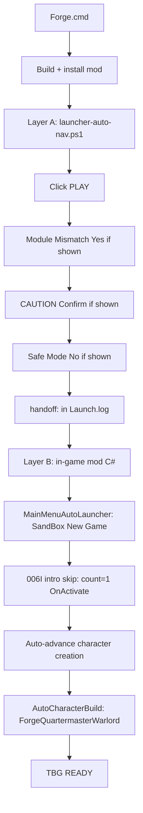

# Forge zero-click contract (Play → map)

**Canonical spec** for what `Forge.cmd` must do after the **006I cutscene / intro lifecycle** fixes. Do not regress Path C quit or culture-Back guards when changing this funnel.

Related: [006E launch funnel plan](plans/006e-main-menu-auto-launch.plan.md) · [006I live cert](sprint-006i-live-results.md) · [006J closeout](plans/006j-full-live-cert-closeout.plan.md)

---

## User expectation (one sentence)

Click **`Forge.cmd`** → wait → land on **campaign map** with **`TBG READY`** and **ForgeQuartermasterWarlord** applied — no manual launcher clicks, no Safe Mode acceptance, no character-creation clicks.

---

## Full pipeline (two layers)



| Layer | Runs in | Owner scripts / types |
|-------|---------|------------------------|
| **A — Launcher / OS dialogs** | `powershell.exe` 5.1 (via `Forge.cmd`) | `scripts/launcher-auto-nav.ps1`, `scripts/write-launch-intent.ps1` |
| **B — Main menu → map** | `Bannerlord.exe` + mod DLL | `MainMenuAutoLauncher.cs`, `SandboxCampaignIntroSkip.cs`, `CampaignSetupStateTracker.cs`, `AutoCharacterCreationPatches.cs`, `AutoCharacterBuildService.cs` |

---

## Layer A — Launcher automation (Play path)

**Entry:** `Forge.cmd` → `forge.ps1 -Launch` → `install-mod.ps1` → `launcher-auto-nav.ps1 -LaunchIntent play`

**Precondition:** No `Bannerlord.exe` or `TaleWorlds.MountAndBlade.Launcher` running.

**PLAY / CONTINUE click search order** (inside `UIAHelper.ClickButtonByNameInLauncher` — PID-gated, never desktop-wide unscoped):

1. **Scoped** — descendants of launcher `MainWindowHandle` / UIA window roots (fast path).
2. **PID-global** — `RootElement.FindAll` filtered by TaleWorlds launcher PID (fixes empty main-window UIA tree).
3. **Coordinates** — normalized fractions on launcher rect after 5s stable hwnd (`play` 0.22×0.93, `continue` 0.38×0.93), only if foreground PID is launcher.

Audit (`AUDIT launcher controls`, `AUDIT launcher PID-named elements`) runs once on miss after hwnd stable 5s. `open-bannerlord-launcher.ps1` waits 2s after `Start-Process` before first poll.

**Poll order each tick** (see `launcher-auto-nav.ps1` main loop):

| Step | Dialog / action | Expected log line (`BlacksmithGuild_Launch.log`) |
|------|-----------------|--------------------------------------------------|
| 1 | **PLAY** (or CONTINUE on continue path) | `clicked PLAY` / `clicked CONTINUE` |
| 2 | **Module Mismatch** → Yes / OK / Continue | `clicked Module Mismatch Yes` |
| 3 | **CAUTION** (mod version) → **Confirm** | `clicked CAUTION Confirm` |
| 4 | **Safe Mode** → **No** | `clicked Safe Mode No` |
| 5 | Crash reporter → **No** (if shown) | `clicked crash reporter No` |
| 6 | Hand off to game | `handoff:` … |
| 7 | Post-handoff watchdog until map | `post-handoff: TBG READY detected` |

**Continue path:** use `LaunchForgeContinue.cmd` (`-LaunchIntent continue`) — same dialog handling; cert via 006I-5.

**PowerShell 5.1 encoding:** all `.ps1` files must have **UTF-8 BOM** (use `scripts/tools/Add-Utf8Bom.ps1 -Fix`). Non-ASCII log strings without BOM break Layer A parse on `Forge.cmd`.

---

## Layer B — In-game automation (after handoff)

**Intent file:** `BlacksmithGuild_LaunchIntent.json` (`play` from Forge, `continue` from LaunchForgeContinue).

| Step | Behavior | Evidence (`BlacksmithGuild_Phase1.log`) |
|------|----------|----------------------------------------|
| Main menu | Auto-select **SandBox → New Campaign** (play) or **Continue** (continue intent) | `[TBG QUICKSTART] main menu intent decision` |
| Intro video | **Single** campaign video skip (006I — no replay loop) | `intro skip: campaign video via OnActivate (count=1)` |
| Character creation | Auto culture, narrative menus, face, banner, clan name, review, options | `auto-advancing character creation`, stage transitions |
| Protagonist build | Apply **ForgeQuartermasterWarlord** on bootstrap | `TBG CHARACTER: ForgeQuartermasterWarlord applied` |
| Done | Map ready, bootstrap disarmed | `TBG READY: campaign map ready. Press F8 for commands.` |

**006I guards (do not break):**

- Path C quit: intent consumed → no SandBox replay on return to menu.
- Path B culture Back: no full intro replay when pressing Back at culture stage.
- Post-READY: permanent disarm latch; `decision=block reason=bootstrap already completed this process`.

---

## Entrypoints

| Command | Intent | Use when |
|---------|--------|----------|
| `Forge.cmd` | `play` | **Daily dev** — new SandBox campaign → map |
| `ForgeContinue.cmd` | `continue` | Continue without opening launcher (game exe direct) |
| `LaunchForge.cmd` | `play` | Build + launcher (manual mod checkboxes OK) |
| `LaunchForgeContinue.cmd` | `continue` | Build + launcher + Continue (006I-5 cert) |

---

## PASS signatures (cert rubric)

Collect after a run:

```powershell
Get-Content "C:\Program Files (x86)\Steam\steamapps\common\Mount & Blade II Bannerlord\BlacksmithGuild_Launch.log" -Tail 80
Get-Content "C:\Program Files (x86)\Steam\steamapps\common\Mount & Blade II Bannerlord\BlacksmithGuild_Phase1.log" -Tail 220
```

| Check | PASS |
|-------|------|
| Layer A | `handoff:` present; no `launcher-auto-nav timed out` |
| PLAY | `clicked PLAY` (Forge path) |
| Version / mismatch | `clicked CAUTION Confirm` and/or `clicked Module Mismatch Yes` as needed |
| Safe Mode | `clicked Safe Mode No` if dialog appeared |
| Intro | `count=1` only (not count=2+ on forward bootstrap) |
| Character | Narrative/culture auto-selected; no manual clicks |
| Map | `TBG READY` |
| Quit (optional) | `decision=block reason=intent already consumed` after Pause → Quit |

---

## Implementation map (where to fix)

| Failure | First file to inspect |
|---------|------------------------|
| PLAY not clicked | `scripts/launcher-auto-nav.ps1` — launcher window / button names |
| Module Mismatch stuck | `scripts/launcher-auto-nav.ps1` — `ClickModuleMismatchYes`, poll while game running |
| CAUTION not confirmed | `scripts/launcher-auto-nav.ps1` — `HasCautionDialog`, Confirm / Enter fallback |
| Safe Mode accepted manually | `scripts/launcher-auto-nav.ps1` — `ClickSafeModeNo` |
| No `handoff:` | `scripts/launcher-auto-nav.ps1` — timeout, stable polls |
| Main menu not auto-starting | `MainMenuAutoLauncher.cs`, `BlacksmithGuild_LaunchIntent.json` |
| Intro replay / loop | `SandboxCampaignIntroSkip.cs`, `CampaignSetupStateTracker.cs` |
| Character creation stall | `CampaignSetupStateTracker.cs`, `CharacterCreationReflection.cs` |
| Profile not applied | `AutoCharacterBuildService.cs`, `DevToolsConfig` profile selection |
| Parse error on Forge | `scripts/tools/Add-Utf8Bom.ps1 -Fix` |

---

## Emergency stop

`launcher-auto-nav.ps1` runs headless (no taskbar icon). If it clicks the wrong thing or hangs:

```powershell
cd C:\Users\Cheex\Desktop\dev\Mods\Bannerlord\BlacksmithGuild
.\ForgeStop.cmd
```

Kills Bannerlord, the TaleWorlds launcher, and any Forge shell still running. Close any unrelated windows it may have opened manually.

Every kill is appended to **`BlacksmithGuild_Launch.log`** as `ForgeStop:` lines.

**Safety rule (2026-06-19):** UIA must never click `AutomationElement.RootElement` buttons (`PLAY`, `Yes`, `No`, `Confirm`) — only scoped Bannerlord launcher/game/dialog windows.

**Audit logging:** Every automation click/focus is logged to **`BlacksmithGuild_Launch.log`** with prefix `UIA:` — window title, process name, button name, and mouse coordinates. Session start logs all top-level window titles (`UIA: AUDIT top-level windows`). Heartbeat every 30s logs foreground window. You do not need to watch — grep the log afterward.

After cert runs: **`CollectCertLogs.cmd`** prints all tails in one paste block.

---

## Status (2026-06-19)

| Piece | Code | User cert |
|-------|------|-----------|
| Layer A PLAY / CAUTION / Safe Mode | Shipped (006E) | Partial — needs clean `handoff:` |
| Module Mismatch UIA | Shipped (006I-5) | Pending — `LaunchForgeContinue.cmd` |
| Layer B intro skip + creation | Shipped (006C–006I) | Path A PASS; Path B pending |
| UTF-8 BOM for PS 5.1 | **SHIPPED** — run `scripts/tools/Add-Utf8Bom.ps1 -Fix` after new `.ps1` |
| Desktop UIA click safety | **SHIPPED** — scoped clicks only; `ForgeStop.cmd` |
| Module Mismatch UIA false positive | **FIXED** — exact `Module Mismatch` dialog scope |
| **006I LIVE CERT PASS** | — | **Blocks 005E** until full matrix PASS |

---

## Handoff prompt (next agent / next chat)

```text
Mission: Re-cert Forge zero-click contract (docs/forge-zero-click-contract.md).
User runs Forge.cmd only — expect PLAY, version confirm, Safe Mode No, auto character build, TBG READY.
Do not regress 006I-4 quit fix or culture-Back guard.
Analyze Launch.log + Phase1.log tails; land 006J PASS or smallest fix from implementation map.
```
