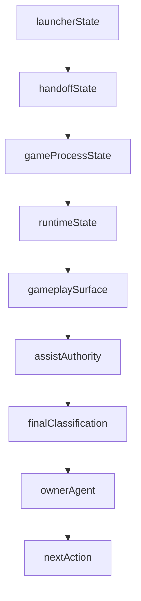

# Runtime State Routing

This document defines the shared state vocabulary agents use to route launcher, process, runtime, gameplay surface, and assist-loop failures. Read it with [`blacksmithguild-agent-coordination.md`](blacksmithguild-agent-coordination.md).

Window selection authority: [`../control/logs/open/window-delta-doctrine.md`](../control/logs/open/window-delta-doctrine.md) and the Ortysia PID/window rules in [`ortysia-live-cert-landmark.md`](ortysia-live-cert-landmark.md). Agent C is the runner consumer: it consumes runtime outputs from Agent B and must not invent gameplay truth when `stateMachine` or `RuntimeLifecycle` are absent or stale.

## Authority split

| Surface | Owner | Authority |
|---|---|---|
| `stateMachine` | Agent B | Runtime gameplay state truth produced by the mod. |
| `RuntimeLifecycle` | Agent B | Runtime attach, lifecycle, and readiness truth produced by the mod. |
| Runner lifecycle | Agent C | External launch, process lifecycle, evidence capture, and runtime-state consumption. |
| Certification judgment | Agent A | PASS / FAIL decision from fresh runner-captured evidence. |
| Routing board | Agent D | Documentation and branch routing; not gameplay certification. |

F7 remains useful as legacy infrastructure, but it is not the product gate. Current authority flows through:

```text
launcher -> handoff -> game process -> RuntimeLifecycle heartbeat -> stateMachine -> assist loop -> evidence
```



---

## Route Owners

| Agent | Role string | Owns |
|-------|-------------|------|
| Agent A | Cert / Evidence / Git / PR | Manifest judgment, PR posture, final PASS/FAIL wording, pushed hygiene. |
| Agent B | Runtime / Readiness / Gameplay safety | `Status.json.stateMachine`, `RuntimeLifecycle.json`, gameplay command safety, runtime shutdown classification. |
| Agent C | External State Classifier / Assistive Runner | Launcher UI, process presence, automation lock, runner classification, post-fix live validation. |
| Agent D | Docs / Atlas / Integration / Routing board | Routing vocabulary, coordination docs, doc drift, cross-agent handoff freshness. |

---

## `launcherState`

| state | source | ownerAgent | nextAction |
|-------|--------|------------|------------|
| `not_started` | launcher process/window search | Agent C | Start only if automation lock is clear and command is authorized. |
| `launcher_visible` | UIA/window classifier | Agent C | Classify Play/Continue availability. |
| `play_continue_visible` | UIA controls or coordinate fallback | Agent C | Select intended launch path. |
| `play_selected` | launch log | Agent C | Watch for dialogs and game handoff. |
| `continue_selected` | launch log | Agent C | Watch for dialogs and game handoff. |
| `module_mismatch` | launcher/UIA or Phase1 log | Agent C | Confirm only through approved automation path. |
| `caution_visible` | launcher/UIA | Agent C | Confirm expected warning. |
| `safe_mode_after_crash` | launcher/UIA | Agent C | Select No, capture failure context, and stop if crash loop repeats. |
| `crash_reporter` | launcher/window classifier | Agent C | Capture failure class; route evidence to Agent A. |
| `handoff_requested` | launch log | Agent C | Transfer watch to process and runtime heartbeat. |

---

## `handoffState`

| state | source | ownerAgent | nextAction |
|-------|--------|------------|------------|
| `no_handoff` | launch log/process timeline | Agent C | Continue launcher classification. |
| `handoff_requested` | launch log | Agent C | Start post-handoff process watch. |
| `process_seen` | process classifier | Agent C | Wait for runtime authority. |
| `post_handoff_fast_fail` | process classifier | Agent C | Route process disappearance to Agent B with timeline evidence. |
| `handoff_complete` | fresh runtime files plus process alive | Agent C | Attach runner only if automation lock is clear. |

---

## `gameProcessState`

| state | source | ownerAgent | nextAction |
|-------|--------|------------|------------|
| `not_running` | process classifier | Agent C | Confirm whether launch was expected before starting anything. |
| `launcher_only` | process/window classifier | Agent C | Continue launcher flow. |
| `starting` | process appears after handoff | Agent C | Begin post-handoff process watch. |
| `main_menu_process_alive` | process plus Phase1/menu markers | Agent C | Wait for runtime state files. |
| `loading_save` | process plus launch/runtime markers | Agent C | Watch for attach readiness. |
| `attach_ready` | process plus fresh runtime files | Agent C | Runner may attach if lock is clear. |
| `process_disappeared_during_post_handoff` | process classifier | Agent C | Route to Agent B for lifecycle/shutdown classification. |
| `exited_expectedly` | process plus lifecycle shutdown marker | Agent B | Record expected shutdown and stop. |
| `exited_unexpectedly` | process without expected lifecycle marker | Agent B | Classify as runtime/process failure before rerun. |

---

## `runtimeState`

| state | source | ownerAgent | nextAction |
|-------|--------|------------|------------|
| `missing_stateMachine` | `Status.json` absent or lacks `stateMachine` | Agent B | Inspect runtime/log producer before changing runner logic. |
| `stateMachine_initializing` | `Status.json.stateMachine` | Agent B | Wait within approved timeout. |
| `stateMachine_ready` | `Status.json.stateMachine` | Agent B | Confirm gameplay surface and assist authority. |
| `runtime_lifecycle_missing` | `RuntimeLifecycle.json` absent | Agent B | Treat runtime authority as missing. |
| `runtime_lifecycle_fresh` | heartbeat age within threshold | Agent B | Runtime is authoritative. |
| `stale_RuntimeLifecycle` | heartbeat age exceeds threshold | Agent B | Compare with process state and logs. |
| `shutdown_expected` | lifecycle shutdown marker | Agent B | Allow Agent C/A to close evidence as expected exit. |
| `shutdown_unexpected` | stale/missing lifecycle plus process exit | Agent B | Classify blocker before live rerun. |

Script aliases:

| Doc term | Script term | Notes |
|----------|-------------|-------|
| `runtime_lifecycle_missing` | `missing_RuntimeLifecycle` | Readiness reason emitted when `RuntimeLifecycle.json` is absent. |
| `stale_RuntimeLifecycle` | `runtime_heartbeat_stale` | Readiness reason emitted when heartbeat age exceeds the threshold. |
| `shutdown_expected` | `clean_shutdown` / `gracefulShutdownObserved` | Lifecycle authority observed an expected or graceful shutdown. |
| `shutdown_unexpected` | `crash_or_unexpected_exit` | Lifecycle authority did not observe an expected shutdown. |

---

## `gameplaySurface`

| state | source | ownerAgent | nextAction |
|-------|--------|------------|------------|
| `unknown` | status/logs | Agent B | Do not claim command safety. |
| `main_menu` | status/logs | Agent B | Route menu automation to Agent C if launch intent is wrong. |
| `loading_screen` | status/logs | Agent B | Wait within approved timeout. |
| `campaign_map` | status/logs | Agent B | Check command safety and assist authority. |
| `settlement_menu` | status/logs | Agent B | Assist may be advisory/execute depending command mode. |
| `town_menu` | status/logs | Agent B | Confirm inbox/assist readiness. |
| `village_menu` | status/logs | Agent B | Confirm route-specific command safety. |
| `tavern_menu` | status/logs | Agent B | Route tavern cert logic. |
| `trade_screen` | status/logs | Agent B | Prevent travel-command assumptions. |
| `inventory_screen` | status/logs | Agent B | Prevent map-command assumptions. |
| `dialogue` | status/logs | Agent B | Decide whether automation can safely exit dialogue. |
| `encounter_menu` | status/logs | Agent B | Treat as command-sensitive. |
| `battle` | status/logs | Agent B | Stop assist unless battle command is explicitly authorized. |
| `paused` | status/logs | Agent B | Do not run movement/trade commands. |
| `map_transition` | status/logs | Agent B | Watch lifecycle and process. |
| `safe_mode_prompt` | UI/runtime hints | Agent C | Route launcher recovery. |
| `crash_reporter` | UI/process hints | Agent C | Route failure capture. |
| `command_in_progress` | runtime command lifecycle | Agent B | Wait for ack/final state. |
| `assist_ready` | status plus assist fields | Agent B | Agent C may start assist loop after Agent A/C scope check. |

Known script/mod surface aliases include `loading`, `conversation`, `trading`, `blacksmithing`, and `settlement_menu`. Treat this table as the owner-routing vocabulary; preserve the raw script value in evidence when it differs.

---

## `assistAuthority`

| value | source | ownerAgent | nextAction |
|-------|--------|------------|------------|
| `none` | status/manifest | Agent B | Do not start assist loop. |
| `advisory_only` | status/manifest | Agent A | Evidence may advise but not claim execution. |
| `execute_allowed` | status/manifest | Agent B | Runner can request execute if scope authorizes it. |
| `execute_in_progress` | command lifecycle | Agent B | Wait for ack and completion. |
| `execute_completed` | command lifecycle/evidence | Agent A | Judge manifest and PR posture. |
| `blocked` | status/manifest/failure class | Agent B | Route blocker before rerun. |
| `stop_unsafe` | status/manifest/failure class | Agent B | Stop automation and capture transparent failure evidence. |

---

## `finalClassification`

| class | Primary owner | Meaning |
|-------|---------------|---------|
| `environment_blocked` | Agent A | Local runtime, launcher, or user authorization is missing; produce handoff instead of pretending validation ran. |
| `runner_blocked` | Agent C | Launcher/process/assist runner cannot safely continue. |
| `runtime_blocked` | Agent B | Runtime state, heartbeat, or gameplay surface authority is absent or unsafe. |
| `evidence_incomplete` | Agent A | Manifest or required evidence is missing; no PASS claim. |
| `live_PASS` | Agent A | Manifest and evidence support the gate claim. |
| `docs_only` | Agent D | Coordination or routing updates only; no product behavior changed. |

---

## Classification to owner to next action

| classification | primary owner | next action |
|----------------|---------------|-------------|
| `continue_not_found` | Agent C | Inspect launcher nav timing and Continue/PLAY click evidence; do not rerun blindly. |
| `attach_not_ready` | Agent C | Wait for attach readiness or classify readiness blockers with Agent B. |
| `process_disappeared_during_post_handoff` | Agent C then Agent B | Capture process timeline, then classify lifecycle shutdown vs unexpected exit. |
| `launcher_menu_misclassified_as_game` | Agent C with Agent B runtime confirmation | Continue was never clicked; foreground/window is still the launcher menu (`TaleWorlds.MountAndBlade.Launcher`, title like "M&B II: Bannerlord"); no real `Bannerlord.exe` or mod attach evidence. Fix classifier/runner (`CertTarget continue`, menu-as-game guards) before live rerun. |
| `game_exited_unexpectedly_before_attach` | Agent B after Agent C detection | True unexpected exit only after ruling out `launcher_menu_misclassified_as_game`. Map process timeline plus `RuntimeLifecycle.json` and `Status.json` before live rerun; stale runtime artifacts can poison termination as `crash_or_unexpected_exit` or `runtime_heartbeat_stale`. |
| `crash_or_unexpected_exit` | Agent B | Use lifecycle authority output to decide runtime shutdown vs crash before runner changes. |
| `missing_stateMachine` | Agent B | Inspect runtime producer and mod logs before changing runner logic. |
| `runtime_heartbeat_stale` / `stale_RuntimeLifecycle` | Agent B | Compare heartbeat age with process state and readiness reasons. |
| `attach_ready` | Agent C | Attach only if automation lock is clear and readiness passes. |
| `live_PASS` | Agent A | Judge manifest, PR posture, and final hygiene. |

---

## Failure Class Mapping

| failureClass | Layer | Primary owner | Evidence to check |
|--------------|-------|---------------|-------------------|
| `play_continue_visible` | launcher | Agent C | `BlacksmithGuild_Launch.log`, launcher classifier output. |
| `continue_selected` | launcher | Agent C | Launch log and handoff marker. |
| `continue_not_found` | launcher | Agent C | Launch log, launcher timing, nav-error mapping from PR11/autonomous runners. |
| `handoff_requested` | launcher/process | Agent C | Launch log and process appearance. |
| `process_disappeared_during_post_handoff` | process/runtime | Agent C then Agent B | Process timeline plus `RuntimeLifecycle.json`. |
| `attach_not_ready` | runtime/process | Agent C | Attach readiness reasons, fresh `Status.json`, process state. |
| `launcher_menu_misclassified_as_game` | launcher/process | Agent C with Agent B runtime confirmation | `BlacksmithGuild_Launch.log` (`game_spawned` / `selectedBy=user` with `attempts=0` while launcher menu foreground), process/window classifier (`launcher_hosted` / `process_detection_uncertain`), absence of fresh `Bannerlord.exe` plus mod runtime files. Distinct from true attach-time exit. |
| `game_exited_unexpectedly_before_attach` | process/runtime | Agent B after Agent C detection | Lifecycle heartbeat, shutdown marker, Phase1 log, process timeline. Rule out `launcher_menu_misclassified_as_game` first. Runner detection may emit Agent C route first; board escalation is B-primary for runtime diagnosis. Stale `RuntimeLifecycle.json` / `Status.json` can overstate crash when mod never loaded. |
| `crash_or_unexpected_exit` | runtime/process | Agent B | `RuntimeLifecycle.json`, termination classification from `process-lifecycle-authority.ps1`. |
| `safe_mode_after_crash` | launcher | Agent C | Launcher state and crash context. |
| `crash_reporter` | launcher/process | Agent C | Crash reporter state and runner summary. |
| `missing_stateMachine` | runtime | Agent B | `Status.json`, Phase1 log, runtime producer code. |
| `stale_RuntimeLifecycle` | runtime | Agent B | `RuntimeLifecycle.json` heartbeat and process state. Script alias: `runtime_heartbeat_stale`. |
| `attach_ready` | runtime/process | Agent C | Fresh runtime files and process alive. Success attach state, not a failure class in all runners. |
| `assist_loop_started` | assist | Agent C | Runner timeline and assist summary. |
| `live_PASS` | evidence | Agent A | Manifest, summary, PR state, final hygiene. |

Layer tables above are normalized agent vocabulary. Runner-emitted `failureClass` and `routeAgent` strings remain canonical for evidence triage. Cross-reference `scripts/process-lifecycle-authority.ps1`, `scripts/autonomous-assist-session.ps1`, `scripts/pr11-runtime-state-consumer.ps1`, `scripts/pr11-process-window-classifier.ps1`, `scripts/run-pr11-town-travel-launch-attach-execute.ps1`, and `scripts/run-autonomous-assist-session.ps1`. If those scripts add or rename classes, update this document and [`blacksmithguild-agent-coordination.md`](blacksmithguild-agent-coordination.md) in the same docs sprint.
