# Sprint 003C: Quick Forge Start (Auto Character)

**Repo:** [BlacksmithGuild](C:\Users\Cheex\Desktop\dev\Mods\Bannerlord\BlacksmithGuild) on `main` (7 commits ahead of origin, clean tree)

**Problem:** Daily dev loop still hits `New Campaign → 10+ screens → map`. Loading a disposable save skips creation; **New Campaign does not**.

**User constraint (this iteration):** Phase 2 must know when the game is at a **menu** or **cutscene**, detect **state transitions**, and only auto-advance on valid transitions — not blind Harmony spam.

---

## What already exists (reuse, do not rewrite)

[`GameSessionState.cs`](src/BlacksmithGuild/DevTools/GameSessionState.cs) already gates post-map dev tools:

- `SessionPhase` — `ModuleOnly` → `CampaignLoading` → `CampaignReady` → `MapPaused` / `MapActive`
- `GameStateManager.Current.ActiveState` — requires `MapState` for `IsCampaignMapReady`
- `MapState.AtMenu` + `GameMenuId` — blocks risky hotkeys when a map panel is open
- `Mission.Current` reflection — blocks when a mission is active

[`BlacksmithGuildCampaignBehavior`](src/BlacksmithGuild/Behaviors/BlacksmithGuildCampaignBehavior.cs) announces **`TBG READY`** only when `GameSessionState.IsCampaignMapReady` becomes true on campaign tick.

**Gap:** This stack assumes `Campaign.Current` exists. During **new sandbox setup** (intro video, character creation UI, cutscenes), `Campaign.Current` is null or not map-ready — the mod has **no visibility** into those phases today.

---

## Phase 1 — Bundled dev save (ship first, no Harmony)

**Fastest win:** stop using New Campaign for daily dev.

1. **One-time user action** (not in git): copy current disposable save to:

```text
Documents\Mount and Blade II Bannerlord\Game Saves\Native\BlacksmithGuild_DevStart.sav
```

2. **New doc:** [`docs/dev-disposable-save.md`](docs/dev-disposable-save.md)
   - Load workflow: `Forge.cmd` → launcher → **Load** `BlacksmithGuild_DevStart.sav` → wait for `TBG READY`
   - Mod ON; legacy saves mod OFF
   - No `.sav` binary in repo (document Documents path only)
   - PASS target: map ready in **~30s**, zero character screens

3. **Update:** [`README.md`](README.md), [`NEXT_STEPS.md`](NEXT_STEPS.md), [`docs/test-plan.md`](docs/test-plan.md)
   - Add Sprint **003C** to sequencing table
   - Daily loop callout: prefer dev save over New Campaign
   - Retest steps for Phase 1 (load save → F7)

**Commit 1:** `Add bundled dev save quick-start docs`

---

## Phase 2 — Auto sandbox character creation (same sprint if build passes)

**Goal:** New Sandbox + mod ON + dev flag → default hero → map, no UI clicking.

**Toggle:** `DevToolsConfig.AutoSkipCharacterCreation = true` (dev only; flag off = vanilla)

**Reference mods (MIT):** QuickStart (`SandBoxGameManager.OnLoadFinished`, `CharacterCreationState.NextStage` postfix), SkipIntro (skip intro video via `Module._splashScreenPlayed`).

### New files

| File | Role |
|------|------|
| [`AutoCharacterCreationConfig.cs`](src/BlacksmithGuild/DevTools/QuickStart/AutoCharacterCreationConfig.cs) | Dev flags: skip intro video, skip creation, trace verbosity |
| [`CampaignSetupStateTracker.cs`](src/BlacksmithGuild/DevTools/QuickStart/CampaignSetupStateTracker.cs) | **State machine** — polled every tick during setup |
| [`AutoCharacterCreationContent.cs`](src/BlacksmithGuild/DevTools/QuickStart/AutoCharacterCreationContent.cs) | Thin `SandboxCharacterCreationContent` subclass (hook point) |
| [`AutoCharacterCreationPatches.cs`](src/BlacksmithGuild/DevTools/QuickStart/AutoCharacterCreationPatches.cs) | Harmony patches + transition-driven auto-advance |

**Harmony:** First use in repo — `Lib.Harmony` NuGet ref; copy `0Harmony.dll` to module bin on build. **No Bannerlord.Harmony module dependency** (not installed on this machine).

**SandBox ref:** Add `SandBox.dll` from `Modules/SandBox/bin/Win64_Shipping_Client/` to [`BlacksmithGuild.csproj`](src/BlacksmithGuild/BlacksmithGuild.csproj).

**Wire in:** [`SubModule.cs`](src/BlacksmithGuild/SubModule.cs) — apply patches in `OnSubModuleLoad` when flag on; poll `CampaignSetupStateTracker` from `OnApplicationTick` until setup complete.

---

## Phase 2 core requirement: setup state machine

### Setup phases (new enum)

Extend pre-map tracking beyond today's `SessionPhase`:

```mermaid
stateDiagram-v2
    direction LR
    MainMenu --> IntroVideo: newSandbox
    IntroVideo --> SandboxVideo: skipIntroOrDone
    SandboxVideo --> CharacterCreation: videoDone
    CharacterCreation --> MapTransition: allStagesDone
    MapTransition --> MapReady: MapState_active
    MapReady --> Handoff: TBG_READY_existing_gate
```



| Phase | Detection signal | Auto action (if flag on) |
|-------|------------------|--------------------------|
| `MainMenu` | No `Game.Current`; or initial module screen root | Wait — do not patch |
| `IntroVideo` | Active state type contains `Video` / splash not played | Set `Module._splashScreenPlayed` (QuickStart pattern) or wait for state pop |
| `SandboxVideo` | Campaign intro video state before creation | Wait or skip when state transitions |
| `CharacterCreation` | `CharacterCreationState` active | Auto-pick first valid option per stage via `NextStage` postfix |
| `CharacterCreationSubStage` | `CurrentStage` type: Culture / FaceGen / Generic / Review / Options | Stage-specific handler; log sub-stage name |
| `MapTransition` | `Campaign.Current` exists but active state != `MapState` | Wait — no hotkey/file inbox yet |
| `MapReady` | `GameSessionState.IsCampaignMapReady` | Stop tracker; existing `TBG READY` path takes over |

### Transition logging (required)

Every phase change writes to Phase1.log:

```text
[TBG QUICKSTART] transition: CharacterCreation(CharacterCreationCultureStage) -> CharacterCreation(CharacterCreationFaceGeneratorStage)
[TBG QUICKSTART] transition: CharacterCreation -> MapTransition (activeState=LoadingState)
[TBG QUICKSTART] setup complete; handing off to map readiness gate
```

On success, one in-game notice:

```text
TBG QUICKSTART: default character applied.
```

### Guards (must implement)

- **Sandbox only** — bail if `StoryModeCharacterCreationContent` or Story Mode game manager path detected
- **Flag off** — no patches applied; vanilla creation unchanged
- **Idempotent** — tracker stops after first `MapReady`; reset on new game load
- **Transition-gated auto-advance** — handlers run only when `CampaignSetupStateTracker.CurrentPhase` matches expected predecessor; never call `NextStage` from arbitrary tick without phase check
- **Cutscene/menu safety** — if active state is unknown or a non-interactive video state, **wait** (poll) rather than force-advance; log `waiting at {phase}` once per phase
- **Story Mode** — out of scope; log `blocked: story mode` and skip automation
- **Traits/appearance** — first/default valid option only; no customization

### Integration with existing map gates

Once `MapState` is active, **stop** the setup tracker and defer to existing machinery:

- [`GameSessionState.Refresh()`](src/BlacksmithGuild/DevTools/GameSessionState.cs) — map menu / mission checks
- [`GameReadinessService.CanRunRiskyCommands`](src/BlacksmithGuild/DevTools/GameReadinessService.cs) — preflight + map menu block
- [`BlacksmithGuildCampaignBehavior.OnCampaignTick`](src/BlacksmithGuild/Behaviors/BlacksmithGuildCampaignBehavior.cs) — `TBG READY` announcement

**F7 extension (optional, same commit if trivial):** add `setupPhase=` / `activeState=` to status JSON when tracker was active this session.

### Harmony patch targets (prefer QuickStart-proven API)

Patch **`SandBoxGameManager.OnLoadFinished`** (prefix) — not `LaunchSandboxCharacterCreation` (private / may differ by game version). QuickStart pattern:

- If not loading save → push `CharacterCreationState` with `AutoCharacterCreationContent`
- If loading save → do not intercept

Patch **`CharacterCreationState.NextStage`** (postfix) — detect stage transitions and invoke stage handlers (culture → face → generic menus → review → options).

**Optional:** intro skip via `Module._splashScreenPlayed` field set in `OnBeforeInitialModuleScreenSetAsRoot` (QuickStart / SkipIntro pattern).

---

## Sprint order (updated)

| Sprint | Status |
|--------|--------|
| 003B Treasury hardening | Shipped — F10 retest pending |
| **003C Quick Forge Start** | **Next** |
| 004 Recommendations | After 003C |

003B retest and 003C Phase 1 can share the same dev save.

---

## Commits

1. `Add bundled dev save quick-start docs` (Phase 1)
2. `Add auto character creation for dev sandbox` (Phase 2 — only if `dotnet build -c Release` passes)

---

## Retest (after implementation)

**Phase 1:** Load `BlacksmithGuild_DevStart.sav` → `TBG READY` → F7

**Phase 2:** Flag on → New Sandbox → no UI → log shows phase transitions → `TBG QUICKSTART` notice → `TBG READY`

**Analyze:**

- `BlacksmithGuild_Phase1.log` — `[TBG QUICKSTART] transition:` lines; no stuck phase >60s
- `BlacksmithGuild_Status.json` — optional setup phase fields
- In-game notice feed — `TBG QUICKSTART` then `TBG READY`

---

## Gaps / risks

| Item | Notes |
|------|-------|
| **Pre-map state is new** | Existing `GameSessionState` is map-centric; setup tracker is separate, polled from `SubModule` |
| **Cutscene detection is heuristic** | Based on `ActiveState` type names + `Module._splashScreenPlayed`; game updates may rename states |
| **Harmony is new** | Dev-only toggle; first dependency of this kind; bundle `0Harmony.dll` |
| **No Bannerlord.Harmony mod** | Self-contained; avoids extra launcher checkbox |
| **Game API drift** | `OnLoadFinished` patch may break; Phase 1 save remains fallback |
| **Story Mode** | Explicitly blocked |
| **Phase 2 build fail** | Ship Phase 1 only; note blocker in NEXT_STEPS; optional external QuickStart mod as fallback |

---

## Repo hygiene (end of sprint)

- `dotnet build -c Release` with Bannerlord closed
- `git status` clean; no stray branches
- Push `main` only if user asks (7 existing + new commits)
