# Sprint 003C Fix — QuickStart Character Creation Automation

## What your screenshots and logs prove

**Foundations are solid.** Your F7/F8/F9 session shows 005C probe command registered, stub forge (Long Warblade 11250), treasury gen=1, and `TBG READY` after you reached the map.

**Why New Campaign did not auto-skip:** Phase1.log shows this on every startup:

```text
[TBG QUICKSTART] CharacterCreationState API not found — intro skip only.
[TBG QUICKSTART] patch apply failed: Null method for com.endeavoreverlasting.blacksmithguild.quickstart
```

At 18:43:47 the tracker entered `CharacterCreation(unknown)` and you sat there ~3 minutes manually — **automation never ran**.

**Root cause (verified against your Bannerlord install):** TaleWorlds refactored character creation. `NextStage`, `CurrentStage`, and menu APIs moved from `CharacterCreationState` to **`CharacterCreationManager`**. Our code in [CharacterCreationReflection.cs](src/BlacksmithGuild/DevTools/QuickStart/CharacterCreationReflection.cs) still looks for `CharacterCreation` + `NextStage` on the state — `_nextStageMethod` is null → `IsAvailable = false`.

Then [AutoCharacterCreationPatches.cs](src/BlacksmithGuild/DevTools/QuickStart/AutoCharacterCreationPatches.cs) calls `Harmony.Patch` on a **null** `NextStage` target, throws, and **aborts the entire `TryApply()`** — so the `SandBoxGameManager.OnLoadFinished` prefix never reliably applies either.

**Misleading notice:** `TBG QUICKSTART: default character applied.` fires on **any** path when map becomes ready ([CampaignSetupStateTracker.cs](src/BlacksmithGuild/DevTools/QuickStart/CampaignSetupStateTracker.cs) `CompleteSetup()`), including **Load save**. That is not proof automation ran.

**Bandits + F10:** F10 uses `CampaignTimeControlMode.UnstoppableFastForward` ([TimeDevTools.cs](src/BlacksmithGuild/DevTools/TimeDevTools.cs)). On the open map that rolls random encounters — you hit a looter barter mid-cert. That is a **bad test design**, not a feature gap. The plan below replaces "wait on the map and hope" with deterministic, safe cert paths.

---

## Strategy (your preference)

| Path | Role |
|------|------|
| **Primary daily** | **Load date-stamped dev save** (~30s, zero character creation) |
| **Secondary / bootstrap** | **New Sandbox** with mod ON → auto-skip character creation → save a fresh dated dev save |
| **Load arbitrary save** | No automation assumptions (current behavior is correct) |

### Date-stamped dev save convention

Replace single fixed name with a documented pattern:

```text
Documents\Mount and Blade II Bannerlord\Game Saves\Native\
  BlacksmithGuild_DevStart_YYYYMMDD.sav     ← canonical daily load target
  BlacksmithGuild_DevStart_YYYYMMDD.bak     ← optional backup before refresh
```

- Update [docs/dev-disposable-save.md](docs/dev-disposable-save.md) and [README.md](README.md) to reference **`BlacksmithGuild_DevStart_<date>.sav`**
- Add a small **PowerShell helper** in [scripts/](scripts/) (e.g. `copy-dev-save.ps1` or extend [scripts/backup-saves.ps1](scripts/backup-saves.ps1)) to copy/rename latest bootstrap save with today's date
- Status JSON / log line on load: `TBG DEVSAVE: loaded (automation not required)` vs New Campaign: `TBG QUICKSTART: sandbox character auto-applied`

---

## Implementation plan

### Phase 1 — Fix reflection for current Bannerlord API

**File:** [CharacterCreationReflection.cs](src/BlacksmithGuild/DevTools/QuickStart/CharacterCreationReflection.cs)

Rebind to the live API surface:

| Old (broken) | New (current game) |
|--------------|-------------------|
| `state.CharacterCreation` | `state.CharacterCreationManager` |
| `state.NextStage()` | `manager.NextStage()` |
| `state.CurrentStage` | `manager.CurrentStage` |
| Menu APIs on `CharacterCreation` | Same method names on `CharacterCreationManager` (`GetCurrentMenuOptions`, `RunConsequence`, `CharacterCreationMenuCount`, `CharacterCreationContent`) |

- Add startup self-check log: `[TBG QUICKSTART] API probe: manager=found nextStage=found` (or explicit missing pieces)
- Keep type resolution: `TaleWorlds.CampaignSystem.CharacterCreationContent.CharacterCreationState` (confirmed present in your install)

### Phase 2 — Harden Harmony patch apply

**File:** [AutoCharacterCreationPatches.cs](src/BlacksmithGuild/DevTools/QuickStart/AutoCharacterCreationPatches.cs)

1. **Patch `CharacterCreationManager.NextStage`** (postfix → `CampaignSetupStateTracker.OnCharacterCreationStage`) instead of state `NextStage`
2. **Apply patches independently** — SandBox `OnLoadFinished` prefix must succeed even if stage postfix is optional; never let one null target fail the whole block
3. Use `AccessTools.DeclaredMethod` for `SandBoxGameManager.OnLoadFinished` (confirmed `Void OnLoadFinished()` in SandBox.dll)
4. Log partial success: `patches: OnLoadFinished=OK, NextStage=OK|SKIP`
5. Set `_applied = true` only when SandBox prefix patch succeeds (minimum viable automation)

### Phase 3 — Stage automation handlers

**File:** [CampaignSetupStateTracker.cs](src/BlacksmithGuild/DevTools/QuickStart/CampaignSetupStateTracker.cs)

- Route `HandleCharacterCreationStage` through updated reflection (culture → face → narrative → review/options/banner/clan)
- Fix sub-stage `unknown`: read `manager.CurrentStage.GetType().Name` after API fix
- **Truthful notices:**
  - New Campaign bootstrap: `TBG QUICKSTART: sandbox character auto-applied.`
  - Load save / no automation: `TBG DEVSAVE: map ready.` (or suppress QUICKSTART notice entirely on load path)
- Track `_bootstrapUsed` flag set only when `OnLoadFinishedPrefix` returns false (intercepted new game)

### Phase 4 — Docs + cert

| Doc | Update |
|-----|--------|
| [docs/dev-disposable-save.md](docs/dev-disposable-save.md) | Date-stamped save naming; Load = daily; New Sandbox = bootstrap only |
| [docs/test-plan.md](docs/test-plan.md) Sprint 003C | Split Phase 1 (load dated save) vs Phase 2 (New Sandbox auto) PASS criteria |
| Create [docs/sprint-003c-live-results.md](docs/sprint-003c-live-results.md) | Live cert protocol + log excerpts |
| [NEXT_STEPS.md](NEXT_STEPS.md) | Primary path = load dated dev save; 003C fix before more feature work |

**Phase 2 live cert PASS criteria (New Sandbox, mod ON):**

- Phase1.log: `[TBG QUICKSTART] Character creation automation enabled.` (no `patch apply failed`)
- Transition lines through culture/face/narrative/review without manual clicks
- Map ready under ~60s
- `TBG QUICKSTART: sandbox character auto-applied.` (only on bootstrap path)

**Phase 1 PASS (daily):**

- Load `BlacksmithGuild_DevStart_YYYYMMDD.sav` → `TBG READY` under ~30s, no character creation screens

### Phase 5 — Safe dev testing (stop dying to bandits)

**Principle:** Cert and daily dev should never require open-map fast-forward or waiting for the world to attack you.

#### 5a — Revise what we certify (docs first)

Replace hostile open-map F10 as a **gate** with a deterministic matrix:

| Goal | Use this | Not this |
|------|----------|----------|
| DailyTick harness | **F9** | F10 |
| Treasury snapshot machinery | **`TreasurySnapshotNow`** + F7 | F10 alone |
| Treasury delta proof | **`TreasurySnapshotNow` → F11 (+100k) → `TreasurySnapshotNow`** | Waiting for random economy on open map |
| Calendar day advance (optional) | New inbox command **`AdvanceCampaignDays N`** (controlled) or F10 **inside town only** | F10 on open steppe |
| Forge / probe / doctrine | Inbox commands on **paused map in town** | Fast-forward while wandering |

Update [docs/test-plan.md](docs/test-plan.md) 003B and [docs/sprint-003-live-results.md](docs/sprint-003-live-results.md): **PARTIAL PASS machinery is enough**; strict F10 multi-day is optional polish, not a blocker.

**Safe cert script (no F10, ~30 seconds on map):**

```powershell
.\forge.ps1 -Command TreasurySnapshotNow -Wait
.\forge.ps1 -Command RankForgeCandidates -Wait
# F11 once (+100k gold)
.\forge.ps1 -Command TreasurySnapshotNow -Wait
# F7 — expect deltaCount > 0 from hero gold change
```

#### 5b — Code guards in [TimeDevTools.cs](src/BlacksmithGuild/DevTools/TimeDevTools.cs)

1. **Block unsafe F10 by default** — refuse `UnstoppableFastForward` unless hero is **inside a settlement** (`Hero.MainHero.CurrentSettlement != null`) OR `DevToolsConfig.AllowUnsafeFastForward = true` (dev escape hatch, default false).
2. **Clear notice:** `TBG F10: BLOCKED — move into a town first, or use TreasurySnapshotNow + F11 for treasury tests.`
3. **Auto-pause on encounter/menu** — in [SubModule.cs](src/BlacksmithGuild/SubModule.cs) tick (or `TimeDevTools.PollSafety`): if fast-forward active and (`PlayerEncounter.Current != null` OR `MapState.AtMenu`), force `TimeControlMode.Stop`, set `_fastForwardActive = false`, log `TBG F10: auto-paused (encounter/menu).`
4. **Pause on map ready** — when `TBG READY` fires, force time stopped so dev session starts safe (dev builds only).

#### 5c — Optional: `AdvanceCampaignDays` dev command

Add to [DevCommandRegistry.cs](src/BlacksmithGuild/DevTools/DevCommandRegistry.cs) / [TimeDevTools.cs](src/BlacksmithGuild/DevTools/TimeDevTools.cs):

- Inbox: `AdvanceCampaignDays` (default 1, or param via separate commands `AdvanceOneCampaignDay` aligned with existing naming)
- Implementation: advance `Campaign.Current.MapEventManager` / campaign clock via supported API (research during impl — prefer official tick over unstoppable FF)
- Gate: same risky gate as F10; **blocked if encounter/menu open**
- Use case: optional 003B calendar proof **without** open-map FF

#### 5d — Safe bootstrap save (dated dev save)

When saving `BlacksmithGuild_DevStart_YYYYMMDD.sav`:

1. Hero **inside a town** (not on open map between settlements)
2. Time **paused** before save
3. Party not in encounter / barter / menu

Document in [docs/dev-disposable-save.md](docs/dev-disposable-save.md) as **mandatory bootstrap checklist**. Optional future: post-automation hook to walk hero to nearest town before first save prompt — out of scope unless trivial.

#### 5e — Docs

| Doc | Add |
|-----|-----|
| [docs/in-game-surfaces.md](docs/in-game-surfaces.md) | F10 rules, auto-pause, safe cert script, encounter = stop testing and close panel |
| [docs/test-plan.md](docs/test-plan.md) | Replace F10-first treasury sequence with deterministic script |
| [docs/sprint-003c-live-results.md](docs/sprint-003c-live-results.md) | Safe testing section |

---

## Architecture after fix

```mermaid
flowchart TD
  subgraph daily [Primary daily path]
    ForgeCmd[Forge.cmd]
    LoadSave[Load DevStart_YYYYMMDD.sav]
    Ready[TBG READY]
    ForgeCmd --> LoadSave --> Ready
  end

  subgraph bootstrap [Bootstrap path]
    NewSandbox[New Sandbox mod ON]
    OnLoadFinished[SandBoxGameManager.OnLoadFinished prefix]
    AutoStages[CharacterCreationManager.NextStage automation]
    SaveDated[Save as DevStart_YYYYMMDD.sav]
    NewSandbox --> OnLoadFinished --> AutoStages --> SaveDated
  end

  subgraph broken [Current bug]
    OldAPI[State.NextStage reflection]
    NullPatch[Harmony null target]
    ManualCC[Manual character creation]
    OldAPI --> NullPatch --> ManualCC
  end
```



---

## What we are NOT doing in this sprint

- Player-facing "Play vs Load" launcher UI (future idea — codify behavior first)
- Story Mode automation (correctly blocked today)
- Removing dev save workflow (stays primary per your preference)
- 005C / 005D forge economics (separate track — run `ProbeForgeRecipes` when map ready)
- God-mode invincibility or combat cheats (not needed — safe location + paused time + deterministic commands are enough)

---

## Suggested commit order

1. `Fix CharacterCreationManager reflection for QuickStart automation`
2. `Harden QuickStart Harmony patches and truthful bootstrap notices`
3. `Add safe dev testing guards and deterministic treasury cert path`
4. `Document date-stamped dev save workflow and Sprint 003C live cert`

---

## Your immediate session (manual)

You are on character creation now — finish manually this once. After the fix ships:

```text
Close game → Forge.cmd → New Sandbox (mod ON) → verify auto-skip → save as BlacksmithGuild_DevStart_YYYYMMDD.sav
Daily thereafter: Load that dated save only
```

**Safe testing after map ready (no bandits required):**

```text
Close any barter/encounter panel → pause time (Space) → F7
.\forge.ps1 -Command TreasurySnapshotNow -Wait
.\forge.ps1 -Command ProbeForgeRecipes -Wait
# F11 once if testing treasury delta
.\forge.ps1 -Command TreasurySnapshotNow -Wait
# Do NOT F10 on open map unless inside a town
```
