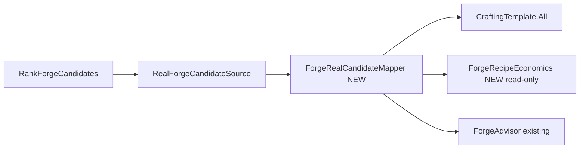

# Sprint 005D — Real Forge Candidates (the meat)

**You are right.** Harness, treasury machinery, stub oracle, probe, F7/F8/F9 — **working**. Character creation automation, F10 bandit roulette, and inbox cert theater are **fuzzy dice**. This sprint builds the car.

**Deferred (backlog — do not block 005D):**
- [QuickStart automation fix plan](C:\Users\Cheex\.cursor\plans\quickstart_automation_fix_8d8f2e24.plan.md) — load dev save manually until fixed
- 003B strict F10, 005A/005B inbox cert, date-stamped save naming, F10 safety guards
- Player-facing UI

**Minimal dev entry (5 min, once per build):**

```text
Close game → Forge.cmd → Load dev save → TBG READY
.\forge.ps1 -Command ProbeForgeRecipes -Wait
.\forge.ps1 -Command SetForgeCandidateSourceReal -Wait
.\forge.ps1 -Command RankForgeCandidates -Wait
# F7 — real weapon names in ranking, source=real, fallbackUsed=false
```

No New Campaign. No F10. No bandits.

---

## What 005C already gives us

[ForgeRecipeProbeService.cs](src/BlacksmithGuild/Forge/ForgeRecipeProbeService.cs) already reads (read-only):

- `CraftingTemplate.All` — weapon templates + `ItemType`
- `CraftingCampaignBehavior` — order count
- Hero smithing skill (`DefaultSkills.Crafting`)

[RealForgeCandidateSource.cs](src/BlacksmithGuild/Forge/RealForgeCandidateSource.cs) runs probe but **returns empty** — probe never maps to `ForgeCandidate` (intentional in 005C).

**005D closes that gap.**

---

## Sprint goal

When `SetForgeCandidateSourceReal` + `RankForgeCandidates`:

- JSON: `sourceKind=Real`, `source=real`, **`fallbackUsed=false`**
- Ranked list contains **real Bannerlord templates** (names/IDs from game data)
- [ForgeAdvisor.cs](src/BlacksmithGuild/ForgeAdvisor.cs) scores them with **read-only economics** (value − material cost − rare penalty)
- Stub oracle (**Long Warblade 11250**) unchanged when source=stub — regression baseline

**Not in 005D:** crafting items, opening smithy UI, Harmony on crafting flow, player recommendation UI.

---

## Architecture



---

## Implementation

### 1. `ForgeRealCandidateMapper.cs` (new)

Input: campaign-ready hero + probe report context.

For each `CraftingTemplate` in `CraftingTemplate.All` (cap e.g. 50–100 for perf, log total):

| ForgeCandidate field | Source (read-only) |
|---------------------|-------------------|
| `Id` | `real.template.{StringId}` |
| `DesignName` | template name / `StringId` (localized if cheap) |
| `WeaponClass` | `template.ItemType.ToString()` |
| `Source` | `"real"` |
| `EstimatedValue` | see economics |
| `EstimatedMaterialCost` | see economics |
| `RareMaterialPenalty` | see economics |

Filter: skip templates hero cannot smith yet if skill gate is readable; otherwise include all and note in `Reason`.

### 2. `ForgeRecipeEconomics.cs` (new)

Read-only profit estimation — **first pass, good enough to rank**:

Research during impl (already confirmed in your install):

- `DefaultSmithingModel` / `SmithingModel` — refining/crafting formulas
- `ItemObject` / `Crafting.GetStatDatas` — sale value hints
- `CraftingCampaignBehavior` — order prices if accessible without mutating

**MVP rule:** if exact material cost unavailable, use conservative heuristic from template tier + log `economicsMode=heuristic` in JSON. **Do not block shipping** on perfect parity with in-game smithy UI.

Return struct: `{ value, materialCost, rarePenalty, detail }`.

### 3. Wire [RealForgeCandidateSource.cs](src/BlacksmithGuild/Forge/RealForgeCandidateSource.cs)

```text
RunProbe (keep JSON evidence)
→ ForgeRealCandidateMapper.TryMapTemplates(out candidates)
→ if count > 0: Ok + return candidates
→ else: Empty + stub fallback (unchanged)
```

Stop double-probing on every rank if cached — use probe cache from last `ProbeForgeRecipes` or single probe per rank (pick simpler: one probe per rank is fine for 005D).

### 4. Extend [ForgeRecommendationService.cs](src/BlacksmithGuild/Forge/ForgeRecommendationService.cs) report

Source section when real:

- `economicsMode`: `exact|heuristic`
- `templateCount` / `mappedCount`
- Top candidate from **game data**, not stub

### 5. Docs (minimal)

- [docs/sprint-005d-live-results.md](docs/sprint-005d-live-results.md) — PASS: real ranking, no fallback
- Update [NEXT_STEPS.md](NEXT_STEPS.md) — 005D is current focus; demote QuickStart to backlog
- One paragraph in [README.md](README.md) current focus

**Skip:** test-plan rewrites, treasury cert updates, QuickStart docs.

---

## PASS criteria (005D live — one session)

| Check | Expected |
|-------|----------|
| Stub regression | `source=stub`, Long Warblade 11250 |
| Real rank | `source=real`, `fallbackUsed=false`, ranked count > 0 |
| Names | Top entries are real template names (not `stub.*`) |
| Phase1.log | `TBG REPORT: FORGE RECOMMENDATIONS` with real source |
| No crash | Map ready, no craft/inventory mutation |
| Probe JSON | Still written; `templateCount` matches mapper input |

---

## Risks

| Risk | Mitigation |
|------|------------|
| Economics API incomplete | Heuristic mode + document; rank order still useful |
| Too many templates | Cap + paginate in JSON later |
| Game update breaks types | 005C probe JSON catches drift |
| Bad ranks vs player intuition | 005D is v1 math; tune in 005E |

---

## After 005D (the actual cool features)

| Sprint | Feature |
|--------|---------|
| **005E** | Crafting orders + hero inventory in economics; doctrine affects real candidates |
| **006** | Player-facing forge advisor UI / workshop integration |
| **003*** | QuickStart fix — when New Campaign pain exceeds load-save |

---

## Execute order (agent session)

1. Implement `ForgeRecipeEconomics` + `ForgeRealCandidateMapper`
2. Wire `RealForgeCandidateSource`; verify stub path untouched
3. `dotnet build -c Release` + `Forge.cmd`
4. User: 3 inbox commands + F7
5. Document `sprint-005d-live-results.md`; commit; push

**Mantra shift:** Math before hammer still — but now the math uses **real recipes**, not stub oracles.
