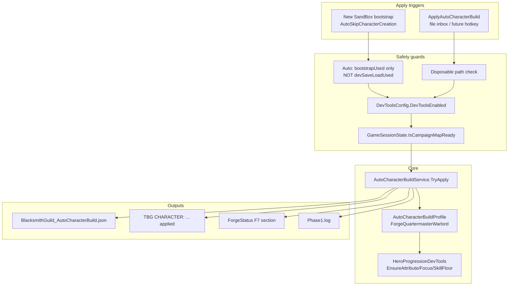

# Sprint 006A — Auto Protagonist Build

## Pivot context

User priority shifts from 005E economics polish to **campaign-ready protagonist shaping**. 005D live cert can remain pending; this sprint does not touch forge ranking, inventory, gold, or smithy UI.

**User constraint (confirmed):** Auto-apply runs **only on new-game QuickStart bootstrap** — not on Continue/dev-save reload. Manual `ApplyAutoCharacterBuild` remains available for disposable campaigns at any time.

---

## Architecture



---

## 1. New module: `DevTools/AutoCharacterBuild/`

Create three files under [`src/BlacksmithGuild/DevTools/AutoCharacterBuild/`](src/BlacksmithGuild/DevTools/AutoCharacterBuild/):

| File | Responsibility |
|------|----------------|
| `AutoCharacterBuildProfile.cs` | Static definition `ForgeQuartermasterWarlord` — attribute/focus/skill floor targets from spec |
| `AutoCharacterBuildReport.cs` | Before/after dictionaries, `changes[]`, `warnings[]`, `errors[]`, flags (`applied`, `normalSaveProtected`, etc.) |
| `AutoCharacterBuildService.cs` | Orchestrator: capture snapshot → apply profile via progression helpers → write JSON → emit notice/log → cache last report for F7 |

**Profile targets** (exact values from spec):

- Attributes: Intelligence 7, Endurance 7, Social 6, Cunning 3, Vigor 2, Control 2
- Focus: Steward 5, Crafting 5, Leadership 5, Medicine 3, Engineering 3, Charm 3, Trade 2, Athletics 2, Riding 2, Scouting 1, Tactics 1
- Skill floors: Steward/Crafting 75, Leadership 50, Medicine/Engineering/Charm 40, Trade/Athletics/Riding 25

Use `DefaultSkills.*` and `DefaultCharacterAttributes.*` (already imported in [`HeroProgressionDevTools.cs`](src/BlacksmithGuild/DevTools/HeroProgressionDevTools.cs)).

---

## 2. Generalize progression helpers

Extend [`HeroProgressionDevTools.cs`](src/BlacksmithGuild/DevTools/HeroProgressionDevTools.cs) — do **not** duplicate the existing Smithing/endurance pattern:

```csharp
// New methods (each returns bool + optional failure reason for report)
EnsureAttribute(Hero, CharacterAttribute attribute, int target)
EnsureFocus(Hero, SkillObject skill, int target)
EnsureSkillFloor(Hero, SkillObject skill, int targetLevel)
AddSkillXp(Hero, SkillObject skill, float xpDelta)
```

**Implementation rules (match existing proven pattern):**

- Guard `hero?.HeroDeveloper == null` → return false, log warning
- For attributes/focus: if `UnspentAttributePoints` / `UnspentFocusPoints` insufficient, grant delta first (same as current `AddEnduranceAttribute` / `AddSmithingFocus`)
- For skill floors: read `hero.GetSkillValue(skill)`; if below target, add XP in bounded loops using `HeroDeveloper.AddSkillXp(skill, chunk, false, false)` until level ≥ target or max iterations (avoid brittle direct level writes)
- Wrap each TaleWorlds call in try/catch; failures become report `errors[]` entries, not crashes
- Keep existing `AddSmithingXp` / `AddSmithingFocus` / `AddEnduranceAttribute` as thin wrappers or unchanged — progression tests must still pass

---

## 3. Broaden snapshot for reporting

Extend or add companion to [`CharacterProgressionSnapshot.cs`](src/BlacksmithGuild/DevTools/CharacterProgressionSnapshot.cs):

- Add `CharacterBuildSnapshot.Capture(Hero)` returning dictionaries for all profile attributes, focus skills, and floor skills
- Used by `AutoCharacterBuildReport` before/after blocks
- Existing smithing-only snapshot stays for Sprint 002 regression tests

---

## 4. Auto-apply hook (new game only)

**Config** — add to [`DevToolsConfig.cs`](src/BlacksmithGuild/DevTools/DevToolsConfig.cs):

```csharp
public static bool AutoApplyCharacterBuild = true; // default ON
```

**Expose disposable-path flags** on [`CampaignSetupStateTracker.cs`](src/BlacksmithGuild/DevTools/QuickStart/CampaignSetupStateTracker.cs):

```csharp
public static bool BootstrapUsed => _bootstrapUsed;
public static bool DevSaveLoadUsed => _devSaveLoadUsed;
public static bool UsedDisposableQuickStartPath => _bootstrapUsed || _devSaveLoadUsed;
```

**Hook** — one-shot in [`BlacksmithGuildCampaignBehavior.cs`](src/BlacksmithGuild/Behaviors/BlacksmithGuildCampaignBehavior.cs) inside existing map-ready block (lines 76–83):

```csharp
if (!_hasAppliedAutoCharacterBuild
    && DevToolsConfig.AutoApplyCharacterBuild
    && CampaignSetupStateTracker.BootstrapUsed      // NEW GAME ONLY
    && !CampaignSetupStateTracker.DevSaveLoadUsed)  // exclude Continue/dev-save
{
    _hasAppliedAutoCharacterBuild = true;
    AutoCharacterBuildService.TryApply(Hero.MainHero, trigger: "quickstart-bootstrap");
}
```

Place **after** `GameSessionState.IsCampaignMapReady` is true (same gate as `TBG READY` / treasury init). Do **not** hook character-creation patches or UI automation.

**Safety:** Auto path never fires on Continue/dev-save load. Legacy/personal saves with mod accidentally ON are still protected by the bootstrap-only gate (no auto). Document policy in sprint doc; no save-name API exists today.

---

## 5. Dev command: `ApplyAutoCharacterBuild`

Wire through existing command bus (no new runner class):

| Step | File | Change |
|------|------|--------|
| Constant | `AutoCharacterBuildService.ApplyAutoCharacterBuildCommand` | `"ApplyAutoCharacterBuild"` |
| Registry | [`DevCommandRegistry.cs`](src/BlacksmithGuild/DevTools/DevCommandRegistry.cs) | Add to `RegisteredCommands` |
| Execute | [`DevCommandBus.cs`](src/BlacksmithGuild/DevTools/DevCommandBus.cs) | New case → `AutoCharacterBuildService.TryApplyFromCommand()` |
| Gates | Same file | Add to `RequiresRiskyGate` + `IsMutationCommand` (disposable-campaign warning) |
| Notify | Same file | Add to `NotifyResult` suppress list; service emits `InGameNotice.Info("TBG CHARACTER: ...")` directly |

Command path: requires map-ready preflight (same as `AddSmithingXp`). Works on Continue/disposable save when user explicitly invokes it.

**No new hotkey this sprint** — file inbox only:

```powershell
.\forge.ps1 -Command ApplyAutoCharacterBuild -Wait
```

---

## 6. Report output

**JSON file:** `<Bannerlord>\BlacksmithGuild_AutoCharacterBuild.json`

Minimum schema from spec:

```json
{
  "profile": "ForgeQuartermasterWarlord",
  "applied": true,
  "trigger": "quickstart-bootstrap|command",
  "mainHeroReady": true,
  "campaignReady": true,
  "normalSaveProtected": true,
  "before": { "attributes": {}, "focus": {}, "skills": {} },
  "after": { "attributes": {}, "focus": {}, "skills": {} },
  "changes": [],
  "warnings": [],
  "errors": []
}
```

**In-game notice on success:**

```text
TBG CHARACTER: ForgeQuartermasterWarlord applied — Steward/Crafting/Leadership seeded.
```

**F7 integration** — extend [`ForgeStatus.cs`](src/BlacksmithGuild/ForgeStatus.cs):

- Cache `AutoCharacterBuildSummary` (mirrors `progressionTest` / `forgeRecommendations` pattern)
- `AutoCharacterBuildService.AppendToReport(ReportFormatter)` for F7 section
- `RecordAutoCharacterBuild(...)` called after apply

**Gitignore** — add `BlacksmithGuild_AutoCharacterBuild.json` to [`.gitignore`](.gitignore) (runtime artifact, like other JSON reports).

---

## 7. Documentation and repo pivot

| Doc | Action |
|-----|--------|
| **New** [`docs/sprint-006a-live-results.md`](docs/sprint-006a-live-results.md) | Scope, safety rules, command protocol, PASS/FAIL criteria, failure classification |
| [`NEXT_STEPS.md`](NEXT_STEPS.md) | Pivot: 006A active; 005E deferred; 005D cert optional |
| [`README.md`](README.md) | Add Sprint 006A row; update "Current focus" |
| [`docs/dev-disposable-save.md`](docs/dev-disposable-save.md) | Note: auto-build on new-game bootstrap only; Continue uses explicit command |

---

## 8. Live cert protocol (user-run; agent does not mark PASS without evidence)

### Path A — auto on new game (optional smoke)

1. Close Bannerlord → `Forge.cmd`
2. **Play → SandBox** with **no dev save** (or temporarily rename dev save) → auto character creation → `TBG READY`
3. Verify Phase1.log contains `TBG CHARACTER:` without running inbox command

### Path B — explicit command (primary cert)

1. Close Bannerlord → `Forge.cmd` → **Continue** → `TBG READY`
2. Run:

```powershell
cd C:\Users\Cheex\Desktop\dev\Mods\Bannerlord\BlacksmithGuild
.\forge.ps1 -Command ApplyAutoCharacterBuild -Wait
.\forge.ps1 -Command ShowForgeStatus -Wait
```

3. Press **F7**

### PASS gates

| Check | Expected |
|-------|----------|
| JSON exists | `BlacksmithGuild_AutoCharacterBuild.json` |
| Profile | `ForgeQuartermasterWarlord`, `applied=true` |
| Core skills | Steward/Crafting ≥ 75, Leadership ≥ 50 (or report explains API block) |
| Bottleneck attrs | Intelligence/Endurance/Social at targets (or report explains) |
| Focus | Steward/Crafting/Leadership focus at 5 |
| Log | Phase1.log `TBG CHARACTER:` line |
| Safety | Continue load did **not** auto-mutate without command |
| Regression | Existing `RichSmithingProgressionTest` still works |

### Output files to analyze

```text
...\Mount & Blade II Bannerlord\
  BlacksmithGuild_AutoCharacterBuild.json
  BlacksmithGuild_Phase1.log
  BlacksmithGuild_Status.json
```

---

## 9. Known gaps and risks

| Gap / risk | Mitigation |
|------------|------------|
| Skill floor via XP may overshoot target level slightly | Report actual after-values; tune XP chunk size |
| No save-name enforcement for explicit command | Document mod-OFF on personal saves; mutation warning in bus |
| Attribute totals exceed vanilla creation budget | Dev-only: grant unspent points (existing pattern) |
| API drift on `HeroDeveloper` | Per-field try/catch → report errors, partial apply OK |
| 005D cert still pending | Out of scope; do not modify forge mapper/economics |
| Auto-apply on Continue rejected by user | Bootstrap-only gate enforced |

---

## 10. Build and ship

- `dotnet build src/BlacksmithGuild/BlacksmithGuild.csproj -c Release`
- `Forge.cmd` install (close Bannerlord if blocked)
- Commit to `main`, push
- Do **not** mark sprint PASS in docs until user provides runtime JSON/log evidence

---

## Files touched (summary)

**New (3):** `DevTools/AutoCharacterBuild/*.cs`

**Modified (~10):**
- [`HeroProgressionDevTools.cs`](src/BlacksmithGuild/DevTools/HeroProgressionDevTools.cs)
- [`CharacterProgressionSnapshot.cs`](src/BlacksmithGuild/DevTools/CharacterProgressionSnapshot.cs) or new snapshot helper
- [`DevToolsConfig.cs`](src/BlacksmithGuild/DevTools/DevToolsConfig.cs)
- [`CampaignSetupStateTracker.cs`](src/BlacksmithGuild/DevTools/QuickStart/CampaignSetupStateTracker.cs)
- [`BlacksmithGuildCampaignBehavior.cs`](src/BlacksmithGuild/Behaviors/BlacksmithGuildCampaignBehavior.cs)
- [`DevCommandRegistry.cs`](src/BlacksmithGuild/DevTools/DevCommandRegistry.cs)
- [`DevCommandBus.cs`](src/BlacksmithGuild/DevTools/DevCommandBus.cs)
- [`ForgeStatus.cs`](src/BlacksmithGuild/ForgeStatus.cs)
- [`.gitignore`](.gitignore)
- Docs: `sprint-006a-live-results.md`, `NEXT_STEPS.md`, `README.md`

**Explicitly out of scope:** ForgeRecommendationService, ForgeRealCandidateMapper, Harmony beyond existing QuickStart patches, UI screens, inventory/gold mutation, hotkeys.
