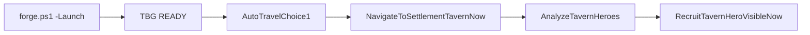

# Sprint 006A — Tavern Hero Intel + Visible Vanilla Recruitment

**Last updated:** 2026-06-21  
**Branch:** `feat/006a-tavern-hero` (from post–auto-travel `main`)  
**Prerequisite:** Auto-travel merged to `main` (`5160f08`–`a5e5901`)

---

## Goal

Read-only tavern hero intel first, then bounded **visible vanilla** recruitment (no `AddHeroToParty` / direct injection). Agents drive game state via inbox commands with **AutoLoop vs Manual** toggle.

---

## Infrastructure delivered

| Area | Files / behavior |
|------|------------------|
| Settlement command polling | `GameSessionState`: `IsSettlementInteriorReady`, `IsTavernLocationReady`, `CanPollFileInbox` (map **or** interior) |
| Status JSON | `ForgeStatus` session block: `activeState`, `settlementReady`, `tavernReady`, `settlementName`, `locationId` |
| Agent iteration config | `BlacksmithGuild_AgentIterationConfig.json` via `write-agent-iteration-config.ps1`; loader `AgentIterationConfigService.cs` |
| Autoloop certs | `run-tavern-hero-intel-cert.ps1`, `run-tavern-hero-recruit-cert.ps1`, CMD wrappers; `forge.ps1 -IterationMode` |

---

## Namespace: `src/BlacksmithGuild/TavernHeroes/`

| File | Role |
|------|------|
| `TavernHeroIntelService.cs` | `AnalyzeTavernHeroes`, `ShowTavernHeroIntel`, `ProbeTavernRecruitmentApi` |
| `TavernHeroScanner.cs` | Settlement/tavern wanderer scan; companion hire price via `CompanionHiringPriceCalculationModel` |
| `TavernHeroScorer.cs` | Doctrine-weighted scoring (SmithingCrew / ScoutQuartermaster / CombatEscort) |
| `TavernHeroDoctrine.cs` | Doctrine presets + setter command ids |
| `TavernHeroModels.cs` | DTOs |
| `TavernHeroJsonWriter.cs` | Manual JSON |
| `SettlementNavigationService.cs` | `NavigateToSettlementTavernNow` — enter settlement, tavern menu, `LocationComplex.ChangeLocation` |
| `TavernHeroVisibleRecruitmentDriver.cs` | Conversation via vanilla APIs; `companion_hire*` dialogue options |
| `TavernHeroRecruitmentService.cs` | `RecruitTavernHeroVisibleNow` — guardrails, before/after JSON, risky gate |

---

## Commands (10)

**Read-only:** `AnalyzeTavernHeroes`, `ShowTavernHeroIntel`, `ProbeTavernRecruitmentApi`, `NavigateToSettlementTavernNow`

**Config:** `SetTavernHeroDoctrineSmithingCrew`, `SetTavernHeroDoctrineScoutQuartermaster`, `SetTavernHeroDoctrineCombatEscort`

**Mutation (risky gate):** `RecruitTavernHeroVisibleNow`

---

## Autoloop contract



**Manual mode:** cert script exits non-zero with gate label (`campaign map or settlement interior required`, `enter town and tavern`) instead of guessing state.

**Config fields** (`BlacksmithGuild_AgentIterationConfig.json`):

| Field | Default | Purpose |
|-------|---------|---------|
| `autoLoop` | `false` | Chain cert steps when true |
| `visibleMode` | `true` | Visible menu/conversation traversal |
| `decisionPauseMs` | `750` | Dwell between visible steps |
| `tavernHeroSafeGoldReserve` | `500` | Block recruit if spend would breach reserve |
| `requireDisposableSaveForRecruit` | `true` | Tier 2 recruit cert refuses Continue saves unless overridden |

---

## Acceptance tiers

| Tier | Check | Evidence |
|------|-------|----------|
| 0 | `dotnet build -c Release` | Build PASS |
| 1 | `RunTavernHeroIntelCert.cmd` | `BlacksmithGuild_TavernHeroIntel.json`: `readOnly:true`, `mutationApplied:false` |
| 2 | `RunTavernHeroRecruitCert.cmd` (disposable) | Recruitment JSON: `directHeroInjectionUsed:false`, before/after gold; Phase1 `[TBG TAVERN SUCCESS]` or `[TBG TAVERN BLOCKED]` |

---

## Output paths (Bannerlord install root)

| File | Command |
|------|---------|
| `BlacksmithGuild_TavernHeroIntel.json` | `AnalyzeTavernHeroes` |
| `BlacksmithGuild_TavernHeroRecruitment.json` | `RecruitTavernHeroVisibleNow` |
| `BlacksmithGuild_TavernHeroRecruitmentProbe.json` | `ProbeTavernRecruitmentApi` |
| `BlacksmithGuild_AgentIterationConfig.json` | `write-agent-iteration-config.ps1` |
| `BlacksmithGuild_Status.json` | F7 — `settlementReady`, `tavernReady` |
| `BlacksmithGuild_Phase1.log` | `[TBG TAVERN]` / `[TBG TRAVEL]` lines |

Mirror to `docs/evidence/latest/` when that directory exists (`ExportTbgEvidence.cmd`).

---

## Known risks

| Risk | Mitigation |
|------|------------|
| No prior tavern/conversation code | Probe-first; block instead of inject |
| Inbox dead inside settlement (pre-006A) | `CanPollFileInbox` includes settlement interior |
| Companion limit / hire cost APIs null | JSON null + warning; block if cost unknown and reserve breached |
| Menu IDs vary by culture/settlement | Log menu ids in probe JSON; cert on known town |
| `StartCombatMissionWithDialogueInTownCenter` may launch mission UI | Validate in Tier 2 smoke; fallback `OpenMapConversation` |
| Auto-travel hostile pause | Cert checks Phase1 travel lines; retry or closer choice |

---

## Out of scope (006A)

Multi-hero vacuum, prisoners, non-tavern wanderers, relationship/gear/skill mutation, `DevOverrideRecruitHero`, Continue-save recruit without override.

---

## Cert commands

```powershell
# Tier 1 — intel (Manual: game already in town/tavern)
.\RunTavernHeroIntelCert.cmd
.\scripts\run-tavern-hero-intel-cert.ps1 -Mode AutoLoop -Launch

# Tier 2 — visible recruit (disposable save)
.\RunTavernHeroRecruitCert.cmd
.\scripts\run-tavern-hero-recruit-cert.ps1 -Mode AutoLoop -Launch
```
