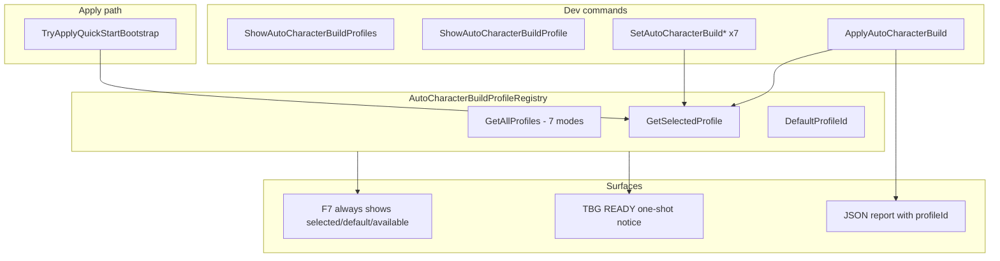

# Sprint 006B — Auto Character Build Profiles and Mode Selection

## Context

006A ([`AutoCharacterBuildProfile.CreateDefault()`](src/BlacksmithGuild/DevTools/AutoCharacterBuild/AutoCharacterBuildProfile.cs)) hardcodes one profile and [`AutoCharacterBuildService.TryApply`](src/BlacksmithGuild/DevTools/AutoCharacterBuild/AutoCharacterBuildService.cs) always calls it. F7 [`AppendToReport`](src/BlacksmithGuild/DevTools/AutoCharacterBuild/AutoCharacterBuildService.cs) is empty until a report exists.

006B turns this into a **profile registry + selection state** while preserving 006A safety: **Continue/dev-save does not auto-apply**.



---

## 1. Extend profile model

Update [`AutoCharacterBuildProfile.cs`](src/BlacksmithGuild/DevTools/AutoCharacterBuild/AutoCharacterBuildProfile.cs):

| Field | Purpose |
|-------|---------|
| `Id` | Stable command/registry key (e.g. `ForgeQuartermasterWarlord`) |
| `DisplayName` | Same as Id for now (no localization sprint) |
| `Description` | One-line mode intent for F7/Show/JSON |
| `ModeKind` | Enum for future filtering (`QuartermasterWarlord`, `SmithEconomist`, …) |
| `IsDefault` | Exactly one profile flagged true |
| Existing dicts | `AttributeTargets`, `FocusTargets`, `SkillFloorTargets` unchanged shape |

Remove `CreateDefault()` from this class — definitions move to registry.

Add small helper (same file or `AutoCharacterBuildProfileBuilder.cs`):

```csharp
static AutoCharacterBuildProfile Build(string id, string description, ModeKind kind,
    bool isDefault, Dictionary<...> attrs, Dictionary<...> focus, Dictionary<...> floors)
```

Use `DefaultSkills.*` / `DefaultCharacterAttributes.*` (including combat skills for `WarCaptain`: `OneHanded`, `Polearm`, `Bow`; `ShadowTrader`: `Roguery`).

---

## 2. Add profile registry

New file: [`AutoCharacterBuildProfileRegistry.cs`](src/BlacksmithGuild/DevTools/AutoCharacterBuild/AutoCharacterBuildProfileRegistry.cs)

**API:**

```csharp
public const string DefaultProfileId = "ForgeQuartermasterWarlord";
AutoCharacterBuildProfile GetSelectedProfile();
bool SetSelectedProfile(string profileId, out string error);
bool TryGetProfile(string profileId, out AutoCharacterBuildProfile profile);
IReadOnlyList<AutoCharacterBuildProfile> GetAllProfiles();
IReadOnlyList<string> GetAllProfileIds();
```

**State:** static `_selectedProfileId`, initialized to `DefaultProfileId` on module load (session-scoped; not persisted to save — acceptable for dev tooling).

**Seven profiles** — exact targets from spec:

| Id | Key attribute emphasis | Notes |
|----|------------------------|-------|
| `ForgeQuartermasterWarlord` | Int 8, End 8, Social 7 | **Default**, upgraded ceilings |
| `SmithEconomist` | End 10, Social 7, Int 7 | Crafting/Trade/Steward focus |
| `KingdomFounder` | Social 9, Int 8, Cunning 5 | Leadership/Charm/Steward |
| `StewardSurgeonEngineer` | Int 10, Social 6, End 5 | Steward/Medicine/Engineering |
| `WarCaptain` | Social 8, Cunning 8, End 6 | Leadership/Tactics/Scouting + combat skills |
| `LightTouchVanillaPlus` | Int 6, End 6, Social 5 | Lower floors/focus |
| `ShadowTrader` | Social 8, Cunning 7, End 5 | Trade/Charm/Scouting/Roguery skeleton |

**Upgraded default (`ForgeQuartermasterWarlord`)** — replace 006A values:

- Attributes: Int **8**, End **8**, Social **7**, Cunning **4**, Vigor **3**, Control **2**
- Focus: Trade **3**, Scouting **2**, Tactics **2** (rest per spec)
- Floors: Steward/Crafting **100**, Leadership **75**, Medicine/Engineering/Charm **50**, Trade **40**, Athletics/Riding **30**, Scouting/Tactics **25**

---

## 3. Service changes

Update [`AutoCharacterBuildService.cs`](src/BlacksmithGuild/DevTools/AutoCharacterBuild/AutoCharacterBuildService.cs):

| Change | Detail |
|--------|--------|
| Apply source | `TryApply` uses `AutoCharacterBuildProfileRegistry.GetSelectedProfile()` |
| Bootstrap | `TryApplyQuickStartBootstrap` unchanged gate; applies **selected** profile |
| Show commands | `ShowProfiles()` / `ShowSelectedProfile()` → `InGameNotice` + `DebugLogger` |
| Set commands | Thin wrappers calling `SetSelectedProfile(id)` |
| Notice on apply | Dynamic: `TBG CHARACTER: {profileId} applied — …` (keep Steward/Crafting/Leadership line for QuartermasterWarlord; generic fallback for other modes) |
| Map-ready hook | New `OnCampaignMapReady()` called from behavior |

**New map-ready behavior** (extract from [`BlacksmithGuildCampaignBehavior`](src/BlacksmithGuild/Behaviors/BlacksmithGuildCampaignBehavior.cs)):

```csharp
AutoCharacterBuildService.OnCampaignMapReady();
// inside service:
// 1. If bootstrap auto-apply succeeds → existing applied notice (skip selection notice)
// 2. Else once per session → InGameNotice.Info(
//      "TBG CHARACTER: default profile {selected.DisplayName} selected. Run ApplyAutoCharacterBuild to apply.")
```

Use separate static flags: `_hasAnnouncedSelectionNotice`, `_hasAttemptedBootstrapApply` (fix current conflation where `_hasAppliedAutoCharacterBuild` blocks notice on Continue).

**Selection notice:** show **selected** profile name (not always hardcoded ForgeQuartermasterWarlord).

---

## 4. F7 / ForgeStatus — always show profile state

Extend [`AutoCharacterBuildSummary`](src/BlacksmithGuild/DevTools/AutoCharacterBuild/AutoCharacterBuildReport.cs):

```csharp
string SelectedProfileId;
string DefaultProfileId;
bool AutoApplyNewGame;
bool ContinueAutoApply; // always false, explicit for cert
string LastAppliedProfileId; // from last report if any
string LastAppliedTrigger;
bool? LastApplied;
string AvailableProfilesCsv;
```

Add `AutoCharacterBuildService.RefreshStatusSnapshot()` — populates summary from registry + last report; call on profile set, apply, and from `ForgeStatus.DisplaySummaryInGame()` before building F7.

Rewrite `AppendToReport`:

```text
Section: Auto Character Build
selectedProfile: ForgeQuartermasterWarlord
defaultProfile: ForgeQuartermasterWarlord
autoApplyNewGame: on
continueAutoApply: off
lastApplied: none | ForgeQuartermasterWarlord (command)
availableProfiles: ForgeQuartermasterWarlord, SmithEconomist, ...
commandHint: ApplyAutoCharacterBuild
```

If last report exists, append applied/trigger/json lines below (006A behavior retained).

Update [`ForgeStatus.cs`](src/BlacksmithGuild/ForgeStatus.cs) JSON `autoCharacterBuild` block to mirror F7 fields even when `HasReport=false`.

---

## 5. JSON report extensions

Update [`AutoCharacterBuildReport`](src/BlacksmithGuild/DevTools/AutoCharacterBuild/AutoCharacterBuildReport.cs) + serializer:

```json
{
  "profileId": "SmithEconomist",
  "profile": "SmithEconomist",
  "profileDescription": "...",
  "selectedProfileAtApply": "SmithEconomist",
  ...
}
```

Populate from profile metadata at apply time.

---

## 6. Command bus wiring

Follow existing Set/Show pattern ([`ForgeRecommendationService`](src/BlacksmithGuild/Forge/ForgeRecommendationService.cs) + [`DevCommandBus`](src/BlacksmithGuild/DevTools/DevCommandBus.cs)):

**New commands** (constants on `AutoCharacterBuildService` or small `AutoCharacterBuildCommands.cs`):

| Command | Mutation? | Risky gate? | Notify suppress? |
|---------|-----------|-------------|------------------|
| `ShowAutoCharacterBuildProfiles` | No | No | Yes |
| `ShowAutoCharacterBuildProfile` | No | No | Yes |
| `SetAutoCharacterBuildForgeQuartermasterWarlord` | No | No | Yes (InGameNotice in service) |
| `SetAutoCharacterBuildSmithEconomist` | … | … | … |
| (×7 Set commands) | No | No | Yes |
| `ApplyAutoCharacterBuild` | Yes | Yes | Yes (service emits notice) |

Register all in [`DevCommandRegistry.cs`](src/BlacksmithGuild/DevTools/DevCommandRegistry.cs); add Execute cases + Show suppress list in `NotifyResult`.

Update [`README.md`](README.md) file-inbox examples with 2–3 new commands (minimal).

---

## 7. Snapshot compatibility

[`CharacterBuildSnapshot.Capture`](src/BlacksmithGuild/DevTools/AutoCharacterBuild/CharacterBuildSnapshot.cs) already accepts a profile — no structural change. Ensure it iterates whatever keys exist in the passed profile (works for WarCaptain combat skills automatically).

---

## 8. Documentation

**New:** [`docs/sprint-006b-live-results.md`](docs/sprint-006b-live-results.md)

- Scope, safety rules (Continue auto-apply OFF unchanged)
- **Profile table** (all 7 modes with attribute/focus/floor summary)
- Cert protocol and PASS criteria from user acceptance list
- Output files unchanged: `BlacksmithGuild_AutoCharacterBuild.json`, Phase1.log, Status.json

**Update:** [`docs/sprint-006a-live-results.md`](docs/sprint-006a-live-results.md) — add one-line note: superseded by 006B for profile targets; 006A mechanics unchanged.

**Update:** [`NEXT_STEPS.md`](NEXT_STEPS.md) — 006B active, 006A cert optional, 005E still after protagonist cert.

---

## 9. Live cert protocol (user-run)

```powershell
Close Bannerlord → Forge.cmd → Continue → TBG READY
.\forge.ps1 -Command ShowAutoCharacterBuildProfiles -Wait
.\forge.ps1 -Command ShowAutoCharacterBuildProfile -Wait
# F7 → selected/default/available BEFORE apply

.\forge.ps1 -Command SetAutoCharacterBuildSmithEconomist -Wait
.\forge.ps1 -Command ApplyAutoCharacterBuild -Wait
# JSON: profileId=SmithEconomist

.\forge.ps1 -Command SetAutoCharacterBuildForgeQuartermasterWarlord -Wait
.\forge.ps1 -Command ApplyAutoCharacterBuild -Wait
# JSON: upgraded Int 8 / End 8 / Social 7 targets
```

**PASS gates:**

- 7 profiles listed; default = ForgeQuartermasterWarlord
- F7 shows profile state before apply
- Set switches selected profile; Apply uses selected
- Continue does not auto-apply
- New SandBox bootstrap may auto-apply **selected** profile only

---

## 10. Out of scope (explicit)

- Forge ranking / 005D mapper
- Inventory, gold, smithy UI
- Character-creation UI / Harmony changes
- Free-form command arguments
- Hotkeys for profile selection
- Save-persisted profile preference

---

## 11. Build and ship

- `dotnet build src/BlacksmithGuild/BlacksmithGuild.csproj -c Release`
- Commit + push to `main`
- Do not mark 006B PASS without runtime JSON/log evidence

---

## Files touched (summary)

**New (1–2):** `AutoCharacterBuildProfileRegistry.cs` (+ optional builder helper)

**Modified (~8):** `AutoCharacterBuildProfile.cs`, `AutoCharacterBuildService.cs`, `AutoCharacterBuildReport.cs`, `BlacksmithGuildCampaignBehavior.cs`, `DevCommandRegistry.cs`, `DevCommandBus.cs`, `ForgeStatus.cs`, docs

**Unchanged:** `HeroProgressionDevTools.cs`, forge modules, QuickStart patches
