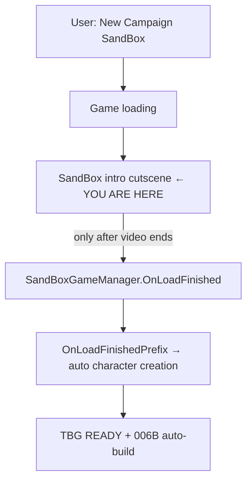

# Sprint 006C — SandBox Intro Skip + Visible QuickStart Bootstrap

## What you are seeing (root cause)

Your screenshot is the **SandBox campaign intro cutscene** (`campaign_intro` — painted narrative with subtitles). The mod’s current QuickStart stack does **not** skip this scene.



**Why bottom-left is empty (no TBG notices):**

| Issue | Detail |
|-------|--------|
| Wrong skip target | [`SkipIntroVideoIfConfigured`](src/BlacksmithGuild/DevTools/QuickStart/AutoCharacterCreationPatches.cs) only sets `Module._splashScreenPlayed` (launcher splash) — **not** the SandBox campaign intro |
| Character skip never runs yet | [`OnLoadFinishedPrefix`](src/BlacksmithGuild/DevTools/QuickStart/AutoCharacterCreationPatches.cs) only fires **after** the intro finishes |
| Notices are file-only | [`CampaignSetupStateTracker.LogWaitingOnce`](src/BlacksmithGuild/DevTools/QuickStart/CampaignSetupStateTracker.cs) logs cutscene wait to Phase1.log only — no `InGameNotice` |
| Campaign not started | `[The Blacksmith Guild] Mod loaded` fires in [`SubModule.OnGameStart`](src/BlacksmithGuild/SubModule.cs) — **after** intro + character creation |

006A/006B auto protagonist build runs at **map ready**, not during the intro. First we must **skip the cutscene and auto-advance creation**.

**User decision (confirmed):** **New Campaign = always fresh bootstrap** — never auto-load dev save on that path. Continue remains the dev-save path.

---

## Goal

After **New Campaign → SandBox**:

1. SandBox intro cutscene is **skipped automatically** (no manual watch/ESC)
2. User sees **TBG QUICKSTART** notices in the message feed at each setup phase
3. Character creation **auto-advances** (existing stage handlers)
4. Map ready → existing **006B** bootstrap auto-build (selected profile)
5. **New Campaign never loads dev save** via `StartNewGame` intercept

---

## 1. Skip SandBox campaign intro cutscene

**New file:** [`src/BlacksmithGuild/DevTools/QuickStart/SandboxCampaignIntroSkip.cs`](src/BlacksmithGuild/DevTools/QuickStart/SandboxCampaignIntroSkip.cs)

Wire from [`AutoCharacterCreationPatches.TryApply()`](src/BlacksmithGuild/DevTools/QuickStart/AutoCharacterCreationPatches.cs) when `AutoSkipCharacterCreation` is true.

**Approach (layered, minimal risk):**

1. **API probe at patch time** — reflect `SandBoxGameManager` for intro-related fields/methods (`_playedIntroVideo`, `LaunchSandboxCharacterCreation`, `LaunchCampaignIntroVideo`, etc.); log findings to Phase1.log (same pattern as character API probe).

2. **Primary patch — mark intro already played** — Harmony prefix/postfix on `SandBoxGameManager.OnLoadFinished` (or the private method that pushes `VideoPlaybackState`) to set intro-played flags **before** vanilla pushes the video state.

3. **Fallback — VideoPlaybackState skip** — if intro state is entered while QuickStart is armed, postfix on video state activation/tick to pop/skip state (equivalent to ESC) when active state name contains `Video`.

4. **Config flag:** `AutoCharacterCreationConfig.SkipSandboxCampaignIntro = true` (default ON).

Do **not** modify Native video files.

Reference: Bannerlord modding pattern — campaign intro is triggered from `SandBoxGameManager.OnLoadFinished` with `campaign_intro` assets ([BannerlordModding intro guide](https://docs.bannerlordmodding.lt/guides/custom_campaign_intro/)).

---

## 2. Visible setup notices (not file-only)

Update [`CampaignSetupStateTracker.cs`](src/BlacksmithGuild/DevTools/QuickStart/CampaignSetupStateTracker.cs):

| Phase | One-shot InGameNotice (when `DevToolsConfig.AutoSkipCharacterCreation`) |
|-------|---------------------------------------------------------------------------|
| `IntroVideo` / `SandboxVideo` | `TBG QUICKSTART: SandBox intro cutscene detected — auto-skipping.` |
| `CharacterCreation` (first entry) | `TBG QUICKSTART: auto-advancing character creation.` |
| Bootstrap complete | Existing `TBG QUICKSTART: sandbox character auto-applied.` |
| Failure | `TBG QUICKSTART: setup stalled at {phase} — see Phase1.log` |

Changes:

- Decouple **user-visible notices** from `AutoCharacterCreationConfig.TraceTransitions` (trace stays for verbose log).
- Add `_hasAnnouncedCutsceneNotice`, `_hasAnnouncedCreationNotice` flags (one-shot, no spam).
- Call `CampaignSetupStateTracker.Poll()` even when phase is `MainMenu` during armed bootstrap (expand early tracking: set `_bootstrapArmed` when SandBox load begins).

**Note:** Message feed may still be limited during pure video states — skipping the cutscene is the real fix; notices will appear once state transitions or immediately before skip.

Also emit notice from [`AutoCharacterCreationPatches.OnLoadFinishedPrefix`](src/BlacksmithGuild/DevTools/QuickStart/AutoCharacterCreationPatches.cs) on success/failure (today file-only).

---

## 3. Harden character creation auto-advance

Keep existing [`OnLoadFinishedPrefix`](src/BlacksmithGuild/DevTools/QuickStart/AutoCharacterCreationPatches.cs) + [`ManagerNextStagePostfix`](src/BlacksmithGuild/DevTools/QuickStart/AutoCharacterCreationPatches.cs) + stage handlers.

Add:

- **Fallback patch** on `SandBoxGameManager.LaunchSandboxCharacterCreation` (private) — if intro skip lands there instead of `OnLoadFinished`, reuse same push-to-creation logic ([BannerlordModding pattern](https://docs.bannerlordmodding.lt/guides/custom_character_backgrounds/)).
- **InGameNotice on failure** when `CharacterCreationReflection.IsAvailable` is false or content/state creation fails (user currently gets silent vanilla path).
- Log `activeState` in probe line at patch apply time.

Optional investigate: `SandBoxGameManager.SimulateCharacterCreation()` static API as simpler path if probe confirms availability on your game version.

---

## 4. New Campaign must not load dev save

Update [`DevSaveAutoLoader.StartNewGamePrefix`](src/BlacksmithGuild/DevTools/QuickStart/DevSaveAutoLoader.cs):

**Default behavior change:** do **not** auto-load dev save on `StartNewGame` (covers New Campaign and Play→SandBox).

| Path | Behavior |
|------|----------|
| **Continue** (launcher) | Loads pinned `BlacksmithGuild_DevStart*.sav` — unchanged |
| **New Campaign / Play SandBox** | Fresh bootstrap with intro skip + auto creation |

Implementation:

- Add `DevToolsConfig.AutoLoadDevSaveOnStartNewGame = false` (default **false** per your choice).
- Gate existing `StartNewGamePrefix` dev-save load behind this flag.
- When disabled, log `[TBG QUICKSTART] StartNewGame: fresh bootstrap (dev save load disabled).`

Update [`docs/dev-disposable-save.md`](docs/dev-disposable-save.md): daily loop = **Continue**; New Campaign = bootstrap/cert path only.

---

## 5. End-to-end bootstrap chain (unchanged targets, fixed ordering)

After intro skip + character auto-advance:

1. `CampaignSetupStateTracker` → MapReady → `TBG QUICKSTART` / `TBG DEVSAVE`
2. [`AutoCharacterBuildService.OnCampaignMapReady()`](src/BlacksmithGuild/DevTools/AutoCharacterBuild/AutoCharacterBuildService.cs) → selection notice or bootstrap auto-apply (006B)
3. F7 shows profile state (006B)

No changes to forge ranking, inventory, or gold.

---

## 6. Docs and cert

**New:** [`docs/sprint-006c-live-results.md`](docs/sprint-006c-live-results.md)

**Update:** [`NEXT_STEPS.md`](NEXT_STEPS.md), [`docs/dev-disposable-save.md`](docs/dev-disposable-save.md), brief note in [`docs/sprint-003c-live-results.md`](docs/sprint-003c-live-results.md) Phase 2.

### Live cert protocol (user-run)

**Path A — New Campaign bootstrap (primary for this fix):**

```text
Close Bannerlord → Forge.cmd → New Campaign → SandBox
```

PASS if:

- Intro cutscene does **not** block (auto-skipped or never shown)
- Bottom-left shows at least one `TBG QUICKSTART:` notice during setup
- No manual character-creation clicks
- Phase1.log: `[TBG QUICKSTART] patches: OnLoadFinished=OK`
- Map ready → `TBG QUICKSTART: sandbox character auto-applied.` or 006B bootstrap notice
- `TBG READY`

**Path B — Continue regression:**

```text
Forge.cmd → Continue → TBG DEVSAVE / TBG READY
```

Dev save still loads; no intro skip required.

### Output files

```text
...\Mount & Blade II Bannerlord\BlacksmithGuild_Phase1.log
...\BlacksmithGuild_Status.json   ← quickStart.setupPhase, activeState
```

---

## 7. Known gaps and risks

| Gap / risk | Mitigation |
|------------|------------|
| Game update renames intro methods | API probe log + layered fallbacks |
| InGameNotice invisible during raw video | Skip video first; notices on transitions |
| Story Mode | Existing `MarkStoryModeBlocked` — no automation |
| Play→SandBox no longer auto-loads dev save | Document Continue as daily path |
| `SimulateCharacterCreation` API drift | Optional; keep reflection path as primary |

---

## Files to touch

| File | Change |
|------|--------|
| **New** `SandboxCampaignIntroSkip.cs` | Intro skip patches |
| `AutoCharacterCreationPatches.cs` | Wire intro skip; visible failure notices |
| `AutoCharacterCreationConfig.cs` | `SkipSandboxCampaignIntro` |
| `CampaignSetupStateTracker.cs` | Visible phase notices |
| `DevSaveAutoLoader.cs` | Gate dev save on StartNewGame (default off) |
| `DevToolsConfig.cs` | `AutoLoadDevSaveOnStartNewGame = false` |
| Docs | sprint-006c, dev-disposable-save, NEXT_STEPS |

**Out of scope:** UI automation clicks, forge economics, new Harmony outside QuickStart folder, SubModule.xml unless version bump convention.

---

## Build and ship

- Release build + `Forge.cmd`
- Commit + push to `main`
- Do **not** mark PASS without your Phase1.log + in-game notice evidence
