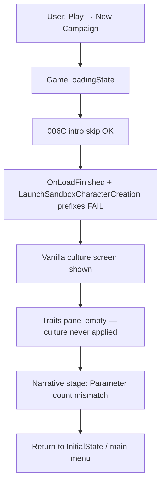

# Sprint 006D — QuickStart v1.4.6 Character Creation Hotfix

## What your screenshots + Phase1.log prove

Your session on **Bannerlord v1.4.6.115628** hit three separate failures:



**Evidence from [`BlacksmithGuild_Phase1.log`](C:\Program Files (x86)\Steam\steamapps\common\Mount & Blade II Bannerlord\BlacksmithGuild_Phase1.log):**

```text
[TBG QUICKSTART] OnLoadFinished: could not create character creation content — vanilla path.
[TBG QUICKSTART] LaunchSandboxCharacterCreation: could not create character creation content — vanilla path.
[TBG QUICKSTART] stage handler failed at CharacterCreationNarrativeStage: Parameter count mismatch.
[TBG QUICKSTART] transition: CharacterCreation(CharacterCreationCultureStage) -> MainMenu (activeState=InitialState)
```

Intro skip **did work** (`SandBox intro cutscene detected — auto-skipping`). Character creation automation **did not**.

---

## Root cause 1 — DIY content creation is dead on v1.4.6

[`CreateSandboxCharacterCreationContent()`](src/BlacksmithGuild/DevTools/QuickStart/AutoCharacterCreationPatches.cs) looks up `SandBox.SandboxCharacterCreationContent`, which **no longer exists** in SandBox.dll on v1.4.6.

Probe results:
- Only concrete type: `TaleWorlds.CampaignSystem.CharacterCreationContent.CharacterCreationContent`
- `Activator.CreateInstance(CharacterCreationContent)` throws (requires game initialization context)
- Therefore both `OnLoadFinished` and `LaunchSandboxCharacterCreation` prefixes fail and fall back to vanilla — but emit misleading **"setup stalled"** notices

**Fix:** Stop trying to replace vanilla character-creation launch. Let `LaunchSandboxCharacterCreation` run normally; only skip intro video (006C) and auto-advance stages afterward.

---

## Root cause 2 — Culture traits never populate

When vanilla lands on culture screen, [`Poll()`](src/BlacksmithGuild/DevTools/QuickStart/CampaignSetupStateTracker.cs) detects `CharacterCreation(CharacterCreationCultureStage)` but **never calls** `HandleCharacterCreationStage` on each tick.

Stage handlers only run when:
- DIY prefix succeeds (broken), or
- `ManagerNextStagePostfix` fires (only after manual `NextStage`)

So `SkipCultureStage` never runs → no `SetSelectedCulture` / `ApplyCulture` → empty trait panel, disabled Next.

**Fix:** In `Poll()`, when phase is `CharacterCreation`, call a new `TryAdvanceCurrentCreationStage()` on the active `CharacterCreationState` every tick (with per-stage retry logic).

Update [`SkipCultureStage`](src/BlacksmithGuild/DevTools/QuickStart/CharacterCreationReflection.cs) for v1.4.6:
- After `SetSelectedCulture(culture, manager)`, call **`ApplyCulture(manager)`** (new API on `CharacterCreationContent`)
- If `GetCultures()` is empty on first tick, **retry** next poll (culture data not ready yet)
- Log probe line for culture methods found/missing

---

## Root cause 3 — Narrative stage API drift

v1.4.6 removed `RunConsequence(manager, option, int, bool)`.

New API:
```csharp
CharacterCreationManager.OnNarrativeMenuOptionSelected(NarrativeMenuOption option)
```

Current code invokes 3-arg `RunConsequence` → **Parameter count mismatch** → bootstrap aborts → you land back on main menu.

**Fix in `SkipNarrativeStage`:**
- Prefer `OnNarrativeMenuOptionSelected(NarrativeMenuOption)`
- Keep `RunConsequence` as legacy fallback for older game builds
- Update API probe to log which narrative method bound

---

## Root cause 4 — Misleading UX

"setup stalled at OnLoadFinished" fires even when vanilla path is **expected and fine**. This made it look broken when culture screen was actually the intended fallback.

**Fix:**
- Remove stall notices when falling back to vanilla launch intentionally
- Replace with info log: `[TBG QUICKSTART] using vanilla character creation launch; Poll will auto-advance stages.`
- Only show visible stall if Poll fails to advance a stage for N seconds

---

## Expected user flow (your stated target)

After fix, manual input should be:

| Step | User action | Mod action |
|------|-------------|------------|
| 1 | Play → New Campaign → SandBox | *(no main-menu automation in 006D)* |
| 2 | — | Skip intro cutscene |
| 3 | — | Auto-select culture + populate traits |
| 4 | — | Auto-advance face / narrative / review / clan name |
| 5 | — | Map ready → 006B auto-build → `TBG READY` |

**Tutorial skip** at first gameplay beat is **not implemented anywhere in repo today** — document as follow-up gap (006E or separate sprint), not part of this hotfix unless you explicitly expand scope.

**Main-menu automation** (Play → auto-pick New Campaign → SandBox with zero clicks) is also **not in scope for 006D** — you confirmed you manually navigated to New Campaign; the blocker is post-load automation, not launcher clicking.

---

## Implementation plan

### 1. Change prefix strategy — [`AutoCharacterCreationPatches.cs`](src/BlacksmithGuild/DevTools/QuickStart/AutoCharacterCreationPatches.cs)

- **Remove** `TryAutoAdvanceSandboxSetup` from `OnLoadFinishedPrefix` and `LaunchSandboxCharacterCreationPrefix` (or reduce to: intro-only / save-game guards, return `true` to vanilla)
- Keep `ManagerNextStagePostfix` as secondary trigger
- Delete dead `CreateSandboxCharacterCreationContent` DIY path (or keep only as logged legacy probe)

### 2. Poll-driven stage engine — [`CampaignSetupStateTracker.cs`](src/BlacksmithGuild/DevTools/QuickStart/CampaignSetupStateTracker.cs)

Add to `Poll()` when `_phase == CharacterCreation`:

```csharp
TryAdvanceCurrentCreationStage(activeState);
```

Behavior:
- Resolve active `CharacterCreationState` from `GameStateManager.Current`
- Read current stage name; call existing `HandleCharacterCreationStage`
- Track `_lastAdvancedSubStage` to avoid double-`NextStage` same tick
- Culture stage: retry until `GetCultures().Count > 0` or timeout → visible stall
- Add `_creationStageStallTimer` for honest stall notice after ~5s stuck on same sub-stage

### 3. Fix reflection bindings — [`CharacterCreationReflection.cs`](src/BlacksmithGuild/DevTools/QuickStart/CharacterCreationReflection.cs)

| Stage | v1.4.6 fix |
|-------|------------|
| Culture | `SetSelectedCulture` + **`ApplyCulture(manager)`** |
| Narrative | **`OnNarrativeMenuOptionSelected(option)`** single-arg |
| Probe | Log `culture=found applyCulture=found narrative=found` |

### 4. Tune notices

- Remove false-positive stall from prefix failure paths
- Keep cutscene skip notice (working)
- Show `TBG QUICKSTART: auto-advancing character creation.` only when Poll actually advances a stage
- Stall notice format: `setup stalled at CharacterCreation/{stage} — see Phase1.log`

### 5. Docs + cert

- New [`docs/sprint-006d-live-results.md`](docs/sprint-006d-live-results.md)
- Update [`docs/sprint-006c-live-results.md`](docs/sprint-006c-live-results.md) verdict to **FAIL on v1.4.6** with pointer to 006D
- Update [`NEXT_STEPS.md`](NEXT_STEPS.md) sequencing

### 6. Live cert protocol (006D PASS)

```text
Close Bannerlord → Forge.cmd → New Campaign → SandBox
```

PASS if:
- Intro cutscene skipped (006C regression)
- Culture screen auto-selects a culture; trait panel populates without click
- No manual clicks through character creation
- Map ready + `TBG READY` within ~60s
- Phase1.log: no `Parameter count mismatch`; no false `setup stalled at OnLoadFinished`
- Continue path still works (`TBG DEVSAVE`)

**Output files:** same as 006C — `BlacksmithGuild_Phase1.log`, `BlacksmithGuild_Status.json`

---

## Known gaps after 006D (explicit)

| Gap | Notes |
|-----|-------|
| Tutorial skip | Not in codebase; user expectation documented for future sprint |
| Play → zero-click menu chain | Out of scope unless requested |
| Story Mode | Still blocked |
| Game version drift | Probe logs remain essential |

## Risks

| Risk | Mitigation |
|------|------------|
| `ApplyCulture` timing | Retry Poll on culture stage |
| Double `NextStage` | Per-sub-stage advance guard |
| Older Bannerlord builds | Keep legacy narrative method fallback |

---

## Files to touch

| File | Change |
|------|--------|
| [`AutoCharacterCreationPatches.cs`](src/BlacksmithGuild/DevTools/QuickStart/AutoCharacterCreationPatches.cs) | Stop DIY intercept; vanilla launch + honest logging |
| [`CampaignSetupStateTracker.cs`](src/BlacksmithGuild/DevTools/QuickStart/CampaignSetupStateTracker.cs) | Poll-driven stage advance + stall timer |
| [`CharacterCreationReflection.cs`](src/BlacksmithGuild/DevTools/QuickStart/CharacterCreationReflection.cs) | v1.4.6 culture + narrative API |
| Docs | sprint-006d, NEXT_STEPS, 006c verdict update |
| [`SubModule.xml`](Module/BlacksmithGuild/SubModule.xml) | Bump to v0.0.9 if repo convention |

**Out of scope:** tutorial skip, main-menu UI automation, forge economics, Harmony outside QuickStart folder.
