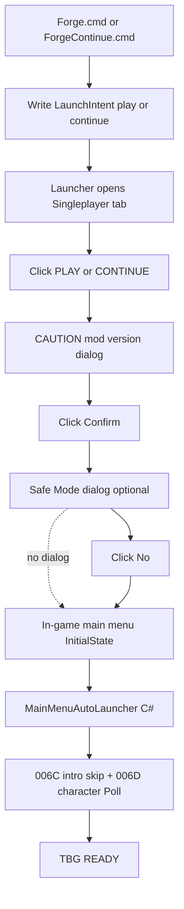

# Sprint 006E — Full Launch Funnel Automation (Forge → Map)

## Full funnel (what you showed us)

After **`Forge.cmd`** or **`ForgeContinue.cmd`**, automation must handle **every screen before the in-game main menu**, then hand off to the existing QuickStart chain.



### Screen inventory (from your screenshots)

| # | Screen | Process / window | Visible anchors | Auto action |
|---|--------|------------------|-----------------|-------------|
| 1 | **Launcher** | `TaleWorlds.MountAndBlade.Launcher.exe` | Singleplayer tab; bottom **PLAY** / **CONTINUE** | Click per intent |
| 2 | **CAUTION** | Launcher or early game overlay | Title **CAUTION**; dependency list; **Cancel** / **Confirm** | **Confirm** |
| 3 | **Safe Mode** | Win32 dialog title **Safe Mode** | "Game shut down unexpectedly..."; **Yes** (focused) / **No** | **No** |
| 4 | **Main menu** | `Bannerlord.exe` — `InitialState` | Saved Games, Continue Campaign, **New Campaign**, **SandBox**, … | In-game mod (Layer B) |
| 5+ | Bootstrap | In-game | Intro, culture, narrative | 006C / 006D (already shipped) |

**Critical split:** Screens 1–3 happen **before the mod DLL is loaded**. They must be automated by **Forge-side PowerShell** (UI Automation), not Harmony. Screen 4+ is **in-game C#**.

---

## Repo contract (document permanently — do not re-explain in chat)

| Forge entry | Launcher button (auto-clicked) | LaunchIntent | In-game auto (Layer B) |
|-------------|-------------------------------|--------------|------------------------|
| **`Forge.cmd`** | **PLAY** | `play` | **New Campaign** → **SandBox** |
| **`ForgeContinue.cmd`** | **CONTINUE** | `continue` | **Continue Campaign** |

Docs: [`docs/dev-disposable-save.md`](docs/dev-disposable-save.md), [`README.md`](README.md), [`docs/sprint-006e-live-results.md`](docs/sprint-006e-live-results.md), [`docs/test-plan.md`](docs/test-plan.md).

**User-facing promise after 006E:**

```text
Forge.cmd          → zero clicks until map (bootstrap cert)
ForgeContinue.cmd  → zero clicks until map (daily dev loop)
```

---

## Layer A — Forge launcher orchestrator (PowerShell)

### New: [`scripts/launcher-auto-nav.ps1`](scripts/launcher-auto-nav.ps1)

Called after [`open-bannerlord-launcher.ps1`](scripts/open-bannerlord-launcher.ps1) starts the launcher.

**Input:** `-LaunchIntent play|continue`, `-BannerlordRoot`, `-TimeoutSec 120`

**Loop** (poll every ~400–500ms until `Bannerlord.exe` running or timeout):

| Priority | Detect | Act |
|----------|--------|-----|
| 1 | Win32 window title **Safe Mode** | Activate **No** (never enable safe mode after crash/task-kill) |
| 2 | UI element text **CAUTION** + **Confirm** button | Click **Confirm** |
| 3 | Launcher window; button **PLAY** or **CONTINUE** | Click per intent (once each) |
| 4 | `Bannerlord.exe` process started | Exit loop success |

**Implementation approach (Windows):**

- Prefer **UI Automation** (`System.Windows.Automation`) — find buttons by **Name** (`PLAY`, `CONTINUE`, `Confirm`, `No`)
- Fallback: Win32 `FindWindow` + `SendMessage` for **Safe Mode** dialog
- One-shot flags per dialog type (no double-click spam)
- Write trace to **`BlacksmithGuild_Launch.log`** in Bannerlord root:

```text
[2026-06-18 ...] launcher-auto: intent=play
[2026-06-18 ...] launcher-auto: clicked PLAY
[2026-06-18 ...] launcher-auto: clicked CAUTION Confirm
[2026-06-18 ...] launcher-auto: clicked Safe Mode No
[2026-06-18 ...] launcher-auto: Bannerlord.exe detected — handoff to in-game mod
```

**Wire into forge:**

| File | Change |
|------|--------|
| [`forge.ps1`](forge.ps1) | `-Launch` → write intent + open launcher + **`launcher-auto-nav.ps1`** |
| [`scripts/install-mod.ps1`](scripts/install-mod.ps1) | Pass `-LaunchIntent` through |
| **New** [`ForgeContinue.cmd`](ForgeContinue.cmd) | Same as Forge but `-LaunchIntent continue` |
| [`.gitignore`](.gitignore) | `BlacksmithGuild_Launch.log`, `BlacksmithGuild_LaunchIntent.json` |

**Opt-out:** `-LaunchManual` skips Layer A (opens launcher only — legacy behavior).

---

## Layer A½ — Reduce CAUTION frequency (SubModule fix)

Your CAUTION screenshot shows `Native(i-1.-1.-1.-1)` because [`Module/BlacksmithGuild/SubModule.xml`](Module/BlacksmithGuild/SubModule.xml) lists dependencies **without** `DependentVersion`.

Official SandBox pattern:

```xml
<DependedModule Id="Native" DependentVersion="v1.4.6" Optional="false"/>
```

**Update all four** (`Native`, `SandBoxCore`, `Sandbox`, `StoryMode`) to match game **v1.4.6**.

This may eliminate CAUTION on clean installs; **keep Confirm automation anyway** (game updates, version drift, first install).

---

## Layer B — In-game main menu (C# — unchanged core from prior plan)

### New: [`MainMenuAutoLauncher.cs`](src/BlacksmithGuild/DevTools/QuickStart/MainMenuAutoLauncher.cs)

When `activeState == InitialState`, read consumed **`BlacksmithGuild_LaunchIntent.json`**:

| Intent | Action |
|--------|--------|
| `play` | `ExecuteInitialStateOptionWithId("NewGame")` → if needed `SandBox` |
| `continue` | `ExecuteInitialStateOptionWithId("Continue")` |

Main menu row → ID map (v1.4.6):

| Visible row | Option ID |
|-------------|-----------|
| Continue Campaign | `Continue` |
| New Campaign | `NewGame` |
| SandBox | `SandBox` |

Probe `GetInitialStateOptions()` once → Phase1.log.

Hook: [`CampaignSetupStateTracker.Poll(dt)`](src/BlacksmithGuild/DevTools/QuickStart/CampaignSetupStateTracker.cs) when `_phase == MainMenu`.

Config: `DevToolsConfig.AutoLaunchFromMainMenu = true`.

Then existing **006C** intro skip + **006D** Poll character advance → **006B** auto-build → `TBG READY`.

---

## Live cert (006E PASS)

### Path A — Bootstrap (zero-click)

```text
Close Bannerlord → Forge.cmd
→ auto PLAY → auto CAUTION Confirm → auto Safe Mode No if shown
→ auto New Campaign → SandBox → intro skip → auto culture → TBG READY
```

### Path B — Daily Continue (zero-click)

```text
Close Bannerlord → ForgeContinue.cmd
→ auto CONTINUE → auto CAUTION Confirm → auto Safe Mode No if shown
→ auto Continue Campaign → TBG DEVSAVE / TBG READY
```

### Output files to analyze

```text
...\Mount & Blade II Bannerlord\
  BlacksmithGuild_Launch.log       ← Layer A trace (PLAY, Confirm, No)
  BlacksmithGuild_LaunchIntent.json ← consumed by in-game mod
  BlacksmithGuild_Phase1.log       ← main menu probe + QuickStart chain
  BlacksmithGuild_Status.json
```

### PASS signals

**Launch.log:** `clicked PLAY` or `clicked CONTINUE`; `Bannerlord.exe detected`

**Phase1.log:**

```text
[TBG QUICKSTART] launch intent: play
[TBG QUICKSTART] main menu probe: NewGame=... SandBox=...
[TBG QUICKSTART] auto-selecting New Campaign.
```

**Must NOT require:** manual launcher clicks, CAUTION Confirm, Safe Mode choice, main menu clicks.

---

## Known gaps (explicit)

| Gap | Notes |
|-----|--------|
| **Tutorial skip** | Out of scope |
| **Launch without Forge** | No Layer A; no intent file → in-game auto skipped |
| **DPI / multi-monitor** | UI Automation may miss buttons; log + manual fallback |
| **CAUTION as GPU overlay** | May need keyboard fallback (Enter) if UIA cannot find Confirm |
| **Launcher UI redesign** | Game update changes button names; log failures clearly |
| **Steam vs MS Store path** | Script uses csproj GameFolder; document if paths differ |

## Risks

| Risk | Mitigation |
|------|------------|
| Double-click PLAY | One-shot per dialog type |
| Safe Mode Yes (default focus) | Explicit **No** by name, not Enter |
| Wrong Forge entry | Forge.cmd vs ForgeContinue.cmd documented at top of dev-disposable-save |
| Automation races splash | Poll loop; wait for control enabled |

---

## Files to touch

| File | Layer | Change |
|------|-------|--------|
| **New** `scripts/launcher-auto-nav.ps1` | A | Full pre-main-menu UI automation |
| **New** `scripts/write-launch-intent.ps1` | A | Intent JSON |
| **New** `ForgeContinue.cmd` | A | Continue intent entry |
| `open-bannerlord-launcher.ps1` / `install-mod.ps1` / `forge.ps1` | A | Wire auto-nav + intent |
| `Module/BlacksmithGuild/SubModule.xml` | A½ | DependentVersion pins |
| **New** `MainMenuAutoLauncher.cs` | B | In-game menu API |
| `CampaignSetupStateTracker.cs` | B | MainMenu Poll hook |
| `DevToolsConfig.cs` | B | `AutoLaunchFromMainMenu` |
| Docs | — | Full funnel + contract |
| `SubModule.xml` version | — | Bump to **v0.0.10** |

**Out of scope:** In-game tutorial skip, forge economics, Harmony outside QuickStart folder.

**Removed contradiction:** Layer A **does** use UI automation — but only in **Forge scripts**, not inside the game mod.
