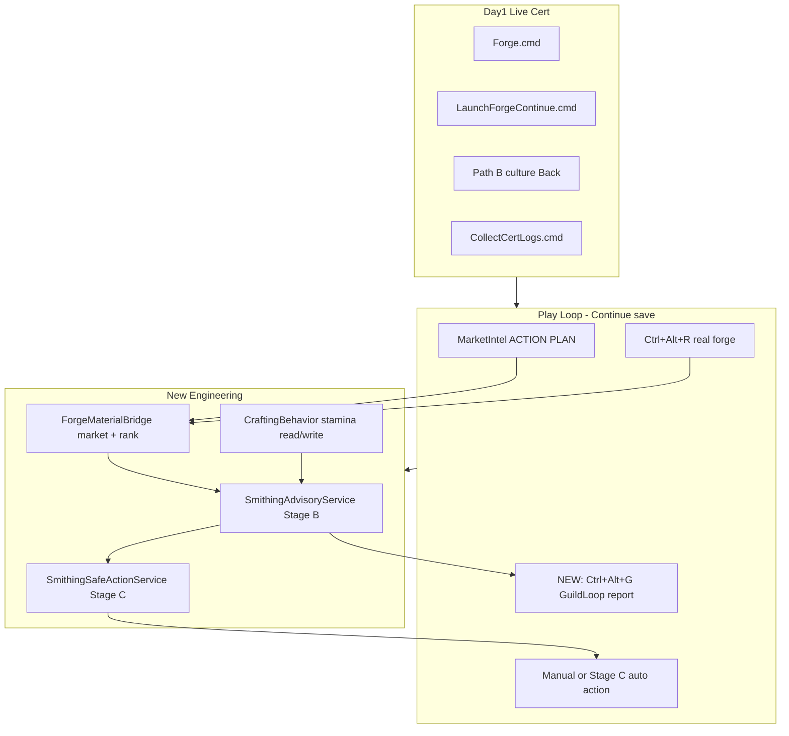
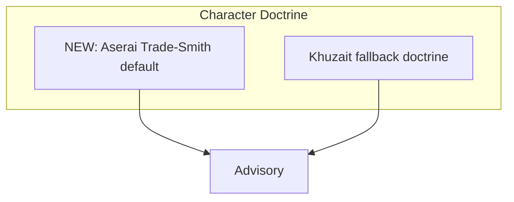

# Sprint 007A — Guild Loop + Advisory Automation

**Status:** IN PROGRESS — 006I-5 Continue **USER PASS** 2026-06-20. 006J partial (1B done; 1C/1D pending). Track 2 next.

**Overview:** Finish 006J closeout (Session 3 play loop + Path B), then ship 005E Stage B advisory plus a Stage C safe automation slice (stamina-aware worker pick + one provably safe forge action via API), with market-forge integration and economics hardening — so you play a real guild loop instead of cert baby steps.

---

## Where you are (do not re-litigate)

**USER PASS (2026-06-20):** Path A bootstrap, Ctrl+Alt+M market action plan (F12 Steam collision fixed), Session 2 disposable real forge rank (`source=real`, Javelin top, templates=12), Smithing Stage A audit, **Continue load (006I-5)** — Tevea map, Phase1 `confirmed (inquiry cleared)`, tag `006i-5-continue-pass` @ `52c2114`.

**Continue save forge honesty:** screenshot shows `fake forge advisor` / `source=stub` on Ctrl+Alt+R until real source wired (Track 2A). Do not claim global real-forge PASS from Continue alone.

**Shipped fixes:** Module Mismatch verify-dismiss (`52c2114`), deferred queue (`687cb1b`), `dev-command-names.ps1`, `forge.ps1 exit 0`, launcher guards + coord fallback.

**Still open:** Session 3 play loop smoke (1C), Path B culture Back (1D), full 006J tag, push to origin (~31 commits ahead).

**Your chosen scope:** Stage B advisory **+ Stage C safe automation slice** (not full Stage D rest optimizer).

---

## Immediate blacksmith mechanics slice

Do this before Aserai character autobuild tuning.

1. ~~Remap market intel hotkey from F12 to Ctrl+Alt+M.~~ **DONE (007A)**
2. ~~Verify market intel still writes `BlacksmithGuild_MarketIntel.json`.~~ **USER PASS (Continue live cert)**
3. Forge ACTION PLAN + SOURCE HONESTY on Ctrl+Alt+R — **SHIPPED (007B)**; real source on Continue still Track 2A
4. Partial forge-materials bridge — forge buy steps use **cached** Ctrl+Alt+M prices (007B); full `--- FORGE MATERIALS ---` market section still open
5. Keep all actions advisory only.

**007B shared formatting:** `ModDisplay`, `AdvisoryReportText`, `AdvisoryReportSections`, `ReportLineClassifier` — reuse for future Ctrl+Alt+G guild loop report.

---

## Sprint goal (one sentence)

On **Continue save**, press one hotkey and get a **coherent guild loop**: where to trade (Ctrl+Alt+M), what to craft (real rank when wired), who should smith next (stamina advisory), and optionally **one safe automated forge action** when reserves allow — without UI click spam.

---

## Character doctrine finding: Aserai Trade-Smith default

Current research finding:

- Aserai is the best default culture for the Blacksmith Guild test character because its bonuses align with the guild loop:
  - cheaper caravans
  - reduced trade penalty
  - no desert speed penalty
  - acceptable +5% party wage drawback
- Khuzait remains a strong mounted-archer and cavalry doctrine fallback, but it is not the default forge-economy culture.
- Do not describe this as a universal combat-meta claim.
- Do not hardcode "best faction" language.
- Treat this as build-purpose doctrine: trade, forge inputs, caravan economy, pit-stop planning, and southern trade loops.

Recommended default profile name:

```text
TBG Aserai Trade-Smith
```

Recommended doctrine:

```text
Culture: Aserai
Primary axis: Trade + Smithing + Riding
Secondary axis: Steward + Charm
Combat support: Bow or Polearm
Troop doctrine: Aserai cavalry / Mamluke line early, Khuzait horse archers optional later
Economic doctrine: caravans, town trade, hardwood / charcoal / ore routing
```

Fallback doctrine:

```text
Fallback culture: Khuzait
Reason: mounted-archer doctrine and cavalry-focused campaign testing
Use when: testing fast mounted party loop, cavalry recruitment, or horse-archer economy
Do not use as default for forge-economy testing
```

---

## Architecture target



Character doctrine config influences advisory language and route preference only — not unsafe automation.



---

## Track 1 — Live cert blitz (user + agent, ~90 min, one sitting)

Run **in order**. Close Chrome/unrelated apps. **`ForgeStop.cmd`** if automation misbehaves.

### 1A — Fresh bootstrap smoke (regression)

```powershell
cd C:\Users\Cheex\Desktop\dev\Mods\Bannerlord\BlacksmithGuild
.\Forge.cmd
```

| Check | PASS |
|-------|------|
| Build/install | `[PASS] build`, `[PASS] install` |
| Map | Phase1: `TBG READY` |
| Launcher | Launch.log: `handoff:` **or** `TBG READY detected (pre-handoff)` **or** `open_launcher` **WARN** + map loaded |
| Hotkeys | F7, F11, F12, Ctrl+Alt+R ack in feed |

### 1B — Continue load (006I-5 re-cert)

**USER PASS 2026-06-20** — tag `006i-5-continue-pass` @ `52c2114`.

Quit Bannerlord fully →

```powershell
.\LaunchForgeContinue.cmd
```

| Check | PASS |
|-------|------|
| No 5-min hang | Map interactive |
| Phase1 | `confirmed (inquiry cleared)` + `TBG READY` |
| No manual Yes | Dialog gone within 2s |

### 1C — Play loop smoke on Continue (Session 3 USER PASS)

On Continue map:

1. **F12** — ACTION PLAN + BUY@NEAREST
2. Enter nearest town → buy top plan item (manual)
3. **Ctrl+Alt+R** — F7 shows `source=real`
4. Enter smithy → open crafting UI (manual baseline)
5. Ride to sell town from plan (optional but ideal)

### 1D — Path B culture Back

Quit → `.\Forge.cmd` → at culture screen press **Back/Escape once**.

| PASS | FAIL |
|------|------|
| Stay in character creation; intro cutscene does **not** replay | Full intro video restarts |

### 1E — Collect evidence + close 006J

```powershell
.\CollectCertLogs.cmd
```

Agent updates:

- [`docs/plans/006j-full-live-cert-closeout.plan.md`](006j-full-live-cert-closeout.plan.md) — mark Path A/B/C, Continue, F12, Session 2 PASS
- [`docs/functionality-status.md`](../functionality-status.md) — fix stale "Session 2 next" line
- Tag suggestion: `006j-live-cert-pass` (user approves)
- Optional: `git push` when user requests

**006J LIVE CERT PASS criteria:** All rows 1A–1D PASS + JSON/log evidence on disk.

---

## Track 1.5 — Character doctrine + auto-config guardrail

This track records the researched character direction for the guild loop.

**Gate:** Ships after Track 1 cert closeout (006J PASS). Do not block Path B re-cert.

### Decision

Default the guild test character to:

```text
Aserai Trade-Smith
```

This supports:

```text
trade-route testing
caravan economy
forge input buying
desert/southern pit-stop loops
market-forge integration
```

Khuzait remains the first fallback for cavalry and mounted-archer doctrine.

### Required implementation style

Do not broad-rewrite character creation automation.

Smallest acceptable implementation after cert gate:

```text
preferredCultureId = "aserai"
fallbackCultureIds = ["khuzait", "empire", "vlandia", "battania", "sturgia"]
```

If an existing config/profile mechanism already exists, use it.

If no config mechanism exists, add the smallest safe constant/config surface near the existing culture-selection reflection logic in [`CharacterCreationReflection.cs`](../../src/BlacksmithGuild/DevTools/QuickStart/CharacterCreationReflection.cs) (`TrySkipCultureStage` currently picks `cultures[0]`).

Expected logging:

```text
[TBG QUICKSTART] preferred culture: aserai
[TBG QUICKSTART] culture auto-selected: aserai (count=N)
```

Fallback logging:

```text
[TBG QUICKSTART] preferred culture unavailable: aserai
[TBG QUICKSTART] culture auto-selected fallback: khuzait (count=N)
```

### Acceptance

PASS only if:

* Culture selection still advances past `CharacterCreationCultureStage`.
* No UI click spam is introduced.
* Existing reflection/poll chain remains intact.
* Preferred culture appears in logs.
* Fallback path is logged when preferred culture is unavailable.
* No unrelated character automation is added.

### Out of scope

```text
full character build planner
trait/perk automation beyond existing safe path
faction allegiance automation
kingdom join automation
troop recruitment automation
combat meta optimizer
```

---

## Track 2 — Economics hardening (agent, parallel to 1C if game open)

Low-risk, high-value before advisory work.

### 2A — Template mapping transparency

Only **5/12** templates mapped ([`ForgeRealCandidateMapper.cs`](../../src/BlacksmithGuild/Forge/ForgeRealCandidateMapper.cs) skill-gate skips blocked templates).

- Extend `BlacksmithGuild_ForgeRecommendations.json` with `skippedTemplates[]` `{ id, reason }`
- Feed line on rank: `mapped 5/12 (7 skill-gated)` when applicable
- **Do not** remove skill gate — explain it

### 2B — Market ↔ forge materials bridge

In [`MarketIntelligenceService.cs`](../../src/BlacksmithGuild/Market/MarketIntelligenceService.cs):

- New feed section **`--- FORGE MATERIALS ---`**: cross-reference `[smith]` route rows + party inventory shortfalls (charcoal, iron ore, hardwood)
- Read top `ForgeRecommendations.json` material needs when rank exists (optional lightweight read)

Acceptance: F12 near town with low charcoal shows buy charcoal @ nearest if in stock.

### 2C — Aserai trade-smith route bias

When producing F12 market guidance, do not hardcode Aserai towns as always best.

Instead, add a lightweight doctrine note to the report when the current/default profile is Aserai:

```text
Doctrine: Aserai Trade-Smith
Bias: prioritize forge fuel, caravan economy, southern/desert pit stops when profitable and safe
```

The route logic should still use actual market data.

Do not fake prices.

Do not force desert routes if the market data does not support them.

---

## Track 3 — 005E Stage B: Smithing advisory (agent, ~1–2 days)

Build on [`SmithingAuditService.cs`](../../src/BlacksmithGuild/Forge/SmithingAuditService.cs) + audit JSON hints.

### 3A — `SmithingAdvisoryService` (new)

| Piece | Detail |
|-------|--------|
| Command | `RunSmithingAdvisoryNow` + inbox + **Ctrl+Alt+G** hotkey |
| JSON | `BlacksmithGuild_SmithingAdvisory.json` |
| Input | Party heroes, crafting skill, stamina via `CraftingCampaignBehavior.GetHeroCraftingStamina` (reflection, proven in audit) |
| Inventory | Reserve floors: charcoal, hardwood, iron tiers (constants, match 005E plan) |
| Orders | Read `CraftingCampaignBehavior.CraftingOrders` count + top order summary if exposed |
| Output | Ranked recommendations: `{ hero, action, target, reason, reserveImpact }` |

**Action enum (Stage B):** `Rest`, `Smelt`, `RefineCharcoal`, `RefineMaterial`, `CraftRanked`, `TakeOrder`, `BuyMaterials` (buy = pointer to F12 plan, no auto-buy).

**Acceptance:** Press Ctrl+Alt+G at town with smithy → feed shows:

```text
--- GUILD ADVISORY ---
Actor: MainHero | Action: Craft Javelin | Stamina: 80/100
Reason: top real rank; reserves OK
Alt: Companion X | Smelt | stamina highest among apprentices
```

### Character doctrine input

`SmithingAdvisoryService` may read the current/default doctrine if available:

```text
Aserai Trade-Smith
Khuzait Mounted Fallback
```

Use doctrine only to explain recommendations.

Do not let doctrine override hard constraints:

```text
stamina
material reserves
inventory availability
town/smithy access
safe route logic
```

Example advisory line:

```text
Doctrine: Aserai Trade-Smith | Priority: charcoal + trade profit before combat expansion
```

### 3B — Unified `GuildLoopReport` (combines existing intel)

Single report merging:

- F12 action plan (call `MarketIntelligenceService` internally)
- Forge top candidate (cached rank)
- Stage B advisory top line

Hotkey: **Ctrl+Alt+G** (Guild loop). F12 remains market-only.

Update [`docs/in-game-surfaces.md`](../in-game-surfaces.md), [`scripts/dev-command-names.ps1`](../../scripts/dev-command-names.ps1).

---

## Track 4 — 005E Stage C: Safe automation slice (agent, ~1–2 days, gated)

**Gate:** Stage B USER PASS on Continue save + successful stamina **read** on 2+ heroes (or main hero read/write in dev sandbox).

### 4A — `SmithingSafeActionService`

Use APIs discovered in Stage A audit — **no Gauntlet UI clicking**.

| Safe action candidates (try in order) | API path |
|---------------------------------------|----------|
| Set active crafting hero | `CraftingCampaignBehavior.SetActiveCraftingHero` |
| Smelt lowest-value smeltable in inventory | behavior smelt hooks if exposed; else **block** |
| Refine charcoal if hardwood OK + charcoal below floor | same |

Rules (hard):

- Never spend below reserve floors
- Never use main hero for smelt/refine if apprentice available with stamina
- Every mutation logs `[TBG FORGE] action=... actor=... reason=... reserveBefore/After`
- Command: `RunSmithingSafeActionNow` — **explicit inbox only first**; hotkey only after USER PASS

Character doctrine must not authorize unsafe mutation.

Aserai default may influence advisory language and route preference, but Stage C still obeys:

- reserve floors
- stamina checks
- explicit inbox command first
- no UI click spam
- no auto-buy/sell
- no full rest optimizer

### 4C cert (user)

On Continue save with ore/charcoal in inventory:

```powershell
.\forge.ps1 -Command RunSmithingSafeActionNow -Wait
```

PASS: inventory/stamina changes match advisory prediction; Phase1 trace complete; no reserve breach.

**Out of scope this sprint:** full order acceptance automation, multi-hero rotation loops, Stage D rest-cycle optimizer.

---

## Track 5 — Dev UX consolidation (agent, small)

Stop one-command-at-a-time tedium:

| Deliverable | Purpose |
|-------------|---------|
| [`scripts/run-guild-cert.ps1`](../../scripts/run-guild-cert.ps1) | One script: advisory probe + rank + market snapshot + collect log paths |
| [`scripts/run-session3-continue-play.ps1`](../../scripts/run-session3-continue-play.ps1) | Documents + runs post-Continue inbox sequence |
| F7 status block | Add `stamina`, `topAdvisory`, `topRoute` compact lines |

---

## Live search / verification checklist (agent runs each commit)

Use this matrix after every engineering drop:

| # | Step | Command / key | Evidence file |
|---|------|---------------|---------------|
| 1 | Build | `dotnet build -c Release` | 0 errors |
| 2 | Install | Close game → `Forge.cmd` or build-only if game open | PendingReload if blocked |
| 3 | Map ready | Enter → `TBG READY` | Phase1.log |
| 4 | Market | F12 | MarketIntel.json `routeRows` |
| 5 | Forge | Ctrl+Alt+R | ForgeRecommendations.json `source=real` |
| 6 | Advisory | Ctrl+Alt+G | SmithingAdvisory.json |
| 7 | Safe action | inbox `RunSmithingSafeActionNow` | Phase1 `[TBG FORGE]` lines |
| 8 | Collect | `CollectCertLogs.cmd` | paste block |

---

## Risks and mitigations

| Risk | Mitigation |
|------|------------|
| Stamina write unsafe | Stage C starts read-only hero select; write only in disposable save |
| Smelt/refine API not callable headless | Stage C ships **SetActiveCraftingHero only** + advisory; document blocked actions in JSON |
| 7/12 templates skill-gated | Transparency in JSON; don't fake rank |
| Allowlist drift | All new commands → `dev-command-names.ps1` |
| Forge.cmd WARN vs FAIL | Already handled; don't regress launcher fixes |
| Doctrine overrides market data | Track 2C + Track 3: doctrine explains only; routes use real prices |
| Culture ID mismatch at runtime | Track 1.5 fallback chain + explicit QUICKSTART logging |
| Context loss next chat | Copy handoff block below |

---

## Known gaps after sprint (honest)

- Auto buy/sell (market remains advisory)
- Stage D rest-cycle optimizer
- Gauntlet trade/smithy UI panel
- Full 12/12 template economics without skill unlocks
- Travel cost / carry weight in routes
- Multi-companion posse rotation at scale
- Character doctrine code (Track 1.5) — planned, config/logging only after cert gate
- Full character build planner / trait automation

---

## Suggested commit / tag sequence

1. `docs: close 006J cert matrix with user evidence`
2. `docs: add Aserai Trade-Smith doctrine to 007A plan`
3. `feat: forge material bridge in F12 + skipped template transparency`
4. `feat: SmithingAdvisory Stage B + Ctrl+Alt+G guild loop`
5. `feat: SmithingSafeAction Stage C slice + inbox command`
6. `chore: run-guild-cert.ps1 + functionality-status refresh`
7. Tag `006j-live-cert-pass` + tag `007a-guild-advisory-shipped` (user approves)

---

## Copy-paste handoff for next agent

```text
BlacksmithGuild @ main (~25 commits ahead origin). v0.0.11.

USER PASS: Path A, F12 action plan, Session 2 real forge (source=real, Javelin),
Smithing Stage A audit (GetHeroCraftingStamina hints).

SPRINT 007A GOAL: Continue play loop + Stage B advisory + Stage C safe automation slice.

CANONICAL PLAN: docs/plans/007a-guild-loop-advisory-automation.plan.md

USER NEXT (Track 1 live cert):
1. Forge.cmd → TBG READY
2. LaunchForgeContinue.cmd → map, Module Mismatch log
3. F12 + Ctrl+Alt+R play loop on Continue
4. Path B culture Back (second Forge.cmd)
5. CollectCertLogs.cmd → update 006j plan → tag 006j-live-cert-pass

ENGINEERING (Tracks 2-4, after cert):
- F12 FORGE MATERIALS section + skipped template JSON
- SmithingAdvisoryService + Ctrl+Alt+G + SmithingAdvisory.json
- SmithingSafeActionService (SetActiveCraftingHero + one safe smelt/refine if API allows)
- scripts/run-guild-cert.ps1

ENGINEERING (Track 1.5, after cert gate):
- preferredCultureId="aserai", fallbackCultureIds starting with "khuzait"
- Hook CharacterCreationReflection.TrySkipCultureStage (currently cultures[0])
- TBG QUICKSTART logging for preferred + fallback paths

CHARACTER DOCTRINE FINDING:
Default culture should become Aserai for the TBG Trade-Smith test profile.
Reason: trade/caravan/desert-route bonuses align with forge economy and pit-stop planning.
Khuzait remains first fallback for mounted-archer/cavalry doctrine, not default forge-economy culture.
Do not frame this as universal combat meta.
Smallest implementation after cert gate: preferredCultureId="aserai", fallbackCultureIds starting with "khuzait", with clear TBG QUICKSTART logging.

KEY FILES:
docs/plans/007a-guild-loop-advisory-automation.plan.md (canonical sprint plan)
src/BlacksmithGuild/Forge/SmithingAuditService.cs (Stage A done)
src/BlacksmithGuild/Market/MarketIntelligenceService.cs
src/BlacksmithGuild/Forge/ForgeRealCandidateMapper.cs
src/BlacksmithGuild/DevTools/QuickStart/CharacterCreationReflection.cs (Track 1.5 hook)
scripts/dev-command-names.ps1, docs/functionality-status.md

DO NOT: promise full auto loop, Gauntlet UI, Stage D rest optimizer, auto-buy/sell,
broad character creation rewrite, or universal combat-meta claims.

OUTPUT PATHS: Phase1.log, Launch.log, MarketIntel.json, ForgeRecommendations.json,
SmithingAudit.json, SmithingAdvisory.json (new), Status.json
```
