# Sprint 008C — Character Choice Catalog + Build Variant Runner

**Status:** CODE SHIPPED — live catalog/matrix runs + **USER visible replay cert PENDING**  
**Branch:** `main` (builds on 008A `0fd9bdb`)  
**Doctrine:** Automate the hands, not the consequences.

---

## One-sentence goal

Stop guessing Aserai Trade-Smith upbringing routes: extract live character-creation options, score candidate paths offline, run top variants with mutation audit, select best build, replay winner visibly for user certification.

---

## User involvement

| Phase | User? |
|-------|-------|
| Catalog run | No |
| Offline matrix scoring | No |
| Variant matrix runs (3–16) | No |
| Best selection | No |
| **Visible replay** | **Yes — watch one run, confirm Aserai + choices + F7 VanillaLegit** |

Game closing during matrix: `ForgeStop.cmd` / `scripts/forge-stop.ps1` between launches. Start orchestrator with no stale Bannerlord process.

---

## Architecture

```mermaid
flowchart LR
  Catalog[run-character-build-catalog.ps1] --> CatalogJson[CharacterChoiceCatalog.json]
  CatalogJson --> Matrix[GenerateCharacterBuildCandidatesNow]
  Matrix --> MatrixJson[CharacterBuildCandidateMatrix.json]
  MatrixJson --> Runner[run-character-build-variant-matrix.ps1]
  Runner --> Runs[character_runs/BuildRun_*.json]
  Runs --> Best[SelectCharacterBuildBestNow]
  Best --> Replay[Visible replay launch]
  Replay --> ReplayJson[CharacterVisibleReplay.json]
```

**Runtime config bridge:** `<BannerlordRoot>/BlacksmithGuild_CharacterBuildVariantConfig.json` (PowerShell writes; C# reads at mod load). Inbox commands do not work during character creation.

---

## New commands (inbox / F8)

| Command | Purpose |
|---------|---------|
| `BuildCharacterChoiceCatalogNow` | Finalize catalog JSON |
| `GenerateCharacterBuildCandidatesNow` | Offline matrix from catalog |
| `SelectCharacterBuildBestNow` | Rank VanillaLegit runs |
| `RunCharacterVisibleReplayNow` | Arm visible replay evidence |
| `DumpCharacterBuildSnapshotNow` | Map-ready full hero snapshot |

---

## Orchestration scripts

| Script | Purpose |
|--------|---------|
| `scripts/run-character-build-catalog.ps1` | ForgeStop → catalog config → launch → TBG READY → matrix |
| `scripts/run-character-build-variant-matrix.ps1` | Sequential variant runs (ForgeStop loop) |
| `RunCharacterBuildVariantMatrix.cmd` | Wrapper (`-NoPause` for agents) |

---

## Evidence outputs

| File | Location |
|------|----------|
| `BlacksmithGuild_CharacterChoiceCatalog.json` | Bannerlord root + `docs/evidence/latest/` |
| `BlacksmithGuild_CharacterBuildCandidateMatrix.json` | Bannerlord root + `docs/evidence/latest/` |
| `BlacksmithGuild_CharacterBuildVariantMatrixReport.json` | `docs/evidence/latest/` |
| `character_runs/BlacksmithGuild_CharacterBuildRun_<id>.json` | Bannerlord root + `docs/evidence/latest/character_runs/` |
| `BlacksmithGuild_CharacterBuildBest.json` | Bannerlord root + `docs/evidence/latest/` |
| `BlacksmithGuild_CharacterVisibleReplay.json` | Bannerlord root + `docs/evidence/latest/` |

Export: `.\ExportTbgEvidence.cmd`

---

## Acceptance (agent PASS)

- [x] `dotnet build -c Release` succeeds
- [ ] Catalog JSON with stages + `extractionErrors` metadata (requires live catalog run)
- [ ] Matrix JSON offline (after catalog run)
- [ ] ≥3 variant routes end-to-end OR blocked with evidence
- [ ] Each run: `postMapProfileApply.enabled=false`, mutation audit clean
- [ ] Best JSON with legitimacy reasoning
- [ ] Visible replay JSON ready (`completed` may be false until user run)

## Acceptance (USER PASS)

- Watch single visible replay: Aserai, ~750ms pauses, F7 VanillaLegit + Assistive, postMapInjection off
- Build beats screenshot on Trade-Smith (Smithing > 0 preferred)

---

## Hard rules

- VanillaLegit only for variant runs; no post-map injection
- Test saves: `BSG_ASR_TEST_*` only — never `TBGPersonalAserai001`
- Full process restart between new-game runs (006I latch)
- Block matrix if catalog `IncompleteCatalog`
- If extraction fails: stop with `extractionErrors` — do not silently guess

---

## Key source files

**New:** `CharacterCreationChoiceCatalogBuilder.cs`, `CharacterCreationRewardTextParser.cs`, `CharacterBuildCandidateGenerator.cs`, `CharacterBuildCandidateScorer.cs`, `CharacterBuildVariantConfigService.cs`, `CharacterBuildRouteSelector.cs`, `HeroBuildSnapshotCapture.cs`, `CharacterBuildMutationAudit.cs`, `CharacterBuildBestSelector.cs`, `CharacterVisibleReplayService.cs`, `CharacterBuildVariantService.cs`

**Modified:** `CharacterCreationReflection.cs`, `CharacterBuildProvenanceService.cs`, `DevToolsConfig.cs`, `DevCommandRegistry.cs`, `DevCommandBus.cs`, `export-tbg-evidence.ps1`, `dev-command-names.ps1`

---

## Risks

| Risk | Mitigation |
|------|------------|
| Menu enumeration reflection fails | Per-menu capture + `extractionErrors`; block matrix |
| 16 runs = long wall-clock | Offline scoring first; cap at 16; visible off |
| Launcher timeout | 900s TBG READY poll in orchestrator |
| Reward parse inaccurate | `confidence: Low`; prefer observed map-ready snapshot |
| Stale JSON | Phase1 + per-run files canonical |
